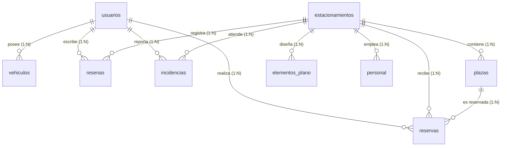

# 🗄️ Documentación Oficial del Esquema de Base de Datos — SMART-PARK

Este documento detalla la estructura física, relacional y lógica de la base de datos de **Smart-Park**. Todas las tablas principales del sistema se encuentran nombradas en español y soportan almacenamiento en **PostgreSQL (Railway)** y **SQLite (Desarrollo Local)**.

---

## 📐 Diagrama de Entidad-Relación (ERD)



---

## 📋 Diccionario de Datos por Tabla

### 1. Tabla: `usuarios`
Almacena las cuentas de acceso de todos los roles del sistema (Conductores, Administradores Locales de Garita y Super Admin Plataforma).

| Campo | Tipo de Dato | Restricciones | Descripción |
| :--- | :--- | :--- | :--- |
| `id` | `INTEGER` | `PRIMARY KEY`, `AUTOINCREMENT` | Identificador único del usuario. |
| `full_name` | `VARCHAR(150)` | `NOT NULL` | Nombre completo del usuario. |
| `email` | `VARCHAR(150)` | `NOT NULL`, `UNIQUE`, `INDEX` | Correo electrónico de inicio de sesión. |
| `phone` | `VARCHAR(30)` | `NULLABLE` | Teléfono / WhatsApp de contacto. |
| `hashed_password` | `VARCHAR(255)` | `NOT NULL` | Contraseña encriptada con Bcrypt. |
| `security_pin` | `VARCHAR(255)` | `DEFAULT '1234'` | PIN de 4 dígitos para garita/operadores. |
| `role` | `VARCHAR(20)` | `NOT NULL`, `DEFAULT 'user'` | Rol RBAC (`user`, `local`, `platform`). |
| `is_active` | `BOOLEAN` | `DEFAULT TRUE` | Estado activo o suspendido de la cuenta. |
| `created_at` | `TIMESTAMP` | `DEFAULT CURRENT_TIMESTAMP` | Fecha y hora de registro. |

---

### 2. Tabla: `vehiculos`
Guarda el padrón de vehículos asociados a los conductores.

| Campo | Tipo de Dato | Restricciones | Descripción |
| :--- | :--- | :--- | :--- |
| `id` | `INTEGER` | `PRIMARY KEY`, `AUTOINCREMENT` | ID del vehículo. |
| `user_id` | `INTEGER` | `FOREIGN KEY (usuarios.id)` | ID del propietario del vehículo. |
| `license_plate` | `VARCHAR(20)` | `NOT NULL`, `INDEX` | Placa patente vehicular (ej. `AYC-501`). |
| `vehicle_type` | `VARCHAR(20)` | `DEFAULT 'auto'` | Categoría (`auto`, `moto`, `suv`, `truck`, `bike`, `pmr`). |
| `brand` | `VARCHAR(50)` | `NULLABLE` | Marca del vehículo (ej. `Toyota`). |
| `model` | `VARCHAR(50)` | `NULLABLE` | Modelo del vehículo (ej. `Yaris`). |
| `color` | `VARCHAR(30)` | `NULLABLE` | Color del vehículo. |

---

### 3. Tabla: `estacionamientos`
Establecimientos o cocheras afiliadas registradas en el sistema.

| Campo | Tipo de Dato | Restricciones | Descripción |
| :--- | :--- | :--- | :--- |
| `id` | `INTEGER` | `PRIMARY KEY`, `AUTOINCREMENT` | ID del estacionamiento. |
| `name` | `VARCHAR(150)` | `NOT NULL` | Nombre comercial de la cochera. |
| `address` | `VARCHAR(255)` | `NOT NULL` | Dirección física de la propiedad. |
| `city` | `VARCHAR(100)` | `NOT NULL`, `INDEX` | Ciudad y distrito (ej. `Ayacucho - Huamanga`). |
| `latitude` | `DOUBLE` | `NOT NULL` | Coordenada GPS latitud. |
| `longitude` | `DOUBLE` | `NOT NULL` | Coordenada GPS longitud. |
| `hourly_rate` | `DOUBLE` | `NOT NULL`, `DEFAULT 8.50` | Tarifa regular por hora (S/). |
| `tolerance_minutes` | `INTEGER` | `DEFAULT 15` | Minutos de tolerancia de cortesía. |
| `status` | `VARCHAR(20)` | `DEFAULT 'active'` | Estado (`active`, `inactive`, `maintenance`). |
| `total_capacity` | `INTEGER` | `DEFAULT 30` | Capacidad total estimada de plazas. |
| `image_url` | `VARCHAR(255)` | `NULLABLE` | Foto representativa del local. |

---

### 4. Tabla: `plazas`
Espacios físicos de estacionamiento mapeados en el diseño interactivo 2D/3D.

| Campo | Tipo de Dato | Restricciones | Descripción |
| :--- | :--- | :--- | :--- |
| `id` | `INTEGER` | `PRIMARY KEY`, `AUTOINCREMENT` | ID de la plaza. |
| `parking_id` | `INTEGER` | `FOREIGN KEY (estacionamientos.id)` | Cochera a la que pertenece. |
| `code` | `VARCHAR(20)` | `NOT NULL` | Código visible (ej. `A-01`, `B-02`). |
| `floor_level` | `VARCHAR(20)` | `DEFAULT 'Piso 1'` | Nivel o piso del plano. |
| `slot_type` | `VARCHAR(20)` | `DEFAULT 'auto'` | Tipo de plaza (`auto`, `moto`, `pmr`). |
| `status` | `VARCHAR(20)` | `DEFAULT 'free'` | Estado (`free`, `occupied`, `reserved`, `disabled`). |
| `pos_x` | `INTEGER` | `DEFAULT 0` | Posición X en el lienzo plano 2D. |
| `pos_y` | `INTEGER` | `DEFAULT 0` | Posición Y en el lienzo plano 2D. |
| `width` | `INTEGER` | `DEFAULT 60` | Ancho del elemento visual en píxeles. |
| `height` | `INTEGER` | `DEFAULT 100` | Largo del elemento visual en píxeles. |
| `rotation` | `INTEGER` | `DEFAULT 0` | Ángulo de rotación en grados (0° - 360°). |

---

### 5. Tabla: `elementos_plano`
Infraestructura arquitectónica del plano (paredes, accesos, garita LPR, pasillos).

| Campo | Tipo de Dato | Restricciones | Descripción |
| :--- | :--- | :--- | :--- |
| `id` | `INTEGER` | `PRIMARY KEY`, `AUTOINCREMENT` | ID del elemento. |
| `parking_id` | `INTEGER` | `FOREIGN KEY (estacionamientos.id)` | Cochera contenedora. |
| `element_type` | `VARCHAR(30)` | `NOT NULL` | Tipo (`wall`, `crosswalk`, `text`, `gate`). |
| `pos_x` | `INTEGER` | `NOT NULL` | Coordenada X. |
| `pos_y` | `INTEGER` | `NOT NULL` | Coordenada Y. |
| `width` | `INTEGER` | `NOT NULL` | Ancho en píxeles. |
| `height` | `INTEGER` | `NOT NULL` | Alto en píxeles. |
| `rotation` | `INTEGER` | `DEFAULT 0` | Rotación. |
| `z_index` | `INTEGER` | `DEFAULT 1` | Capa de renderizado visual. |
| `properties_json` | `TEXT` | `NULLABLE` | Propiedades adicionales JSON (colores, texto). |

---

### 6. Tabla: `reservas`
Transacciones de reserva y ocupación garantizada de estacionamiento.

| Campo | Tipo de Dato | Restricciones | Descripción |
| :--- | :--- | :--- | :--- |
| `id` | `INTEGER` | `PRIMARY KEY`, `AUTOINCREMENT` | ID de la reserva. |
| `code` | `VARCHAR(50)` | `NOT NULL`, `UNIQUE`, `INDEX` | Código único ticket QR (ej. `RSV-98214`). |
| `user_id` | `INTEGER` | `FOREIGN KEY (usuarios.id)` | Conductor que reservó. |
| `parking_id` | `INTEGER` | `FOREIGN KEY (estacionamientos.id)` | Cochera seleccionada. |
| `slot_id` | `INTEGER` | `FOREIGN KEY (plazas.id)` | Plaza asignada. |
| `license_plate` | `VARCHAR(20)` | `NOT NULL` | Placa del vehículo a ingresar. |
| `start_time` | `TIMESTAMP` | `NOT NULL` | Hora estimada de ingreso. |
| `end_time` | `TIMESTAMP` | `NOT NULL` | Hora estimada de salida. |
| `actual_entry` | `TIMESTAMP` | `NULLABLE` | Registro de hora real de entrada ANPR. |
| `actual_exit` | `TIMESTAMP` | `NULLABLE` | Registro de hora real de salida ANPR. |
| `total_cost` | `DOUBLE` | `NOT NULL` | Monto total calculado en soles (S/). |
| `status` | `VARCHAR(20)` | `DEFAULT 'scheduled'` | Estado (`scheduled`, `active`, `completed`, `cancelled`). |
| `qr_code` | `VARCHAR(255)` | `NOT NULL` | Cadena cifrada para generación de QR. |

---

### 7. Tabla: `personal`
Registro de personal y operadores asignados a garitas por los Administradores Locales.

| Campo | Tipo de Dato | Restricciones | Descripción |
| :--- | :--- | :--- | :--- |
| `id` | `INTEGER` | `PRIMARY KEY`, `AUTOINCREMENT` | ID del colaborador. |
| `parking_id` | `INTEGER` | `FOREIGN KEY (estacionamientos.id)` | Cochera asignada. |
| `full_name` | `VARCHAR(150)` | `NOT NULL` | Nombre completo del colaborador. |
| `dni` | `VARCHAR(20)` | `NOT NULL` | Documento Nacional de Identidad. |
| `position` | `VARCHAR(50)` | `NOT NULL` | Cargo (`Operador Garita`, `Supervisor`). |
| `shift` | `VARCHAR(30)` | `DEFAULT 'Mañana'` | Turno laboral (`Mañana`, `Tarde`, `Noche`). |
| `status` | `VARCHAR(20)` | `DEFAULT 'active'` | Estado del colaborador. |
| `email` | `VARCHAR(150)` | `NULLABLE` | Correo de inicio de sesión de personal. |
| `security_pin` | `VARCHAR(20)` | `DEFAULT '1234'` | PIN de acceso rápido a la terminal ANPR. |
| `created_at` | `TIMESTAMP` | `DEFAULT CURRENT_TIMESTAMP` | Fecha de creación del registro. |

---

### 8. Tabla: `resenas`
Opiniones y calificaciones otorgadas por los conductores a las cocheras.

| Campo | Tipo de Dato | Restricciones | Descripción |
| :--- | :--- | :--- | :--- |
| `id` | `INTEGER` | `PRIMARY KEY`, `AUTOINCREMENT` | ID de la reseña. |
| `parking_id` | `INTEGER` | `FOREIGN KEY (estacionamientos.id)` | Cochera calificada. |
| `user_id` | `INTEGER` | `FOREIGN KEY (usuarios.id)` | Conductor autor. |
| `user_name` | `VARCHAR(150)` | `NOT NULL` | Nombre mostrado del autor. |
| `rating` | `INTEGER` | `NOT NULL`, `DEFAULT 5` | Puntuación de 1 a 5 estrellas. |
| `comment` | `TEXT` | `NOT NULL` | Comentario de la experiencia. |
| `response` | `TEXT` | `NULLABLE` | Respuesta emitida por la administración de la cochera. |
| `created_at` | `TIMESTAMP` | `DEFAULT CURRENT_TIMESTAMP` | Fecha de publicación. |

---

### 9. Tabla: `incidencias`
Reportes de eventos o anomalías notificadas en garitas o plazas.

| Campo | Tipo de Dato | Restricciones | Descripción |
| :--- | :--- | :--- | :--- |
| `id` | `INTEGER` | `PRIMARY KEY`, `AUTOINCREMENT` | ID del reporte. |
| `parking_id` | `INTEGER` | `FOREIGN KEY (estacionamientos.id)` | Cochera afectada. |
| `user_id` | `INTEGER` | `FOREIGN KEY (usuarios.id)` | Usuario o colaborador que reporta. |
| `user_name` | `VARCHAR(150)` | `NOT NULL` | Nombre del emisor del reporte. |
| `category` | `VARCHAR(50)` | `DEFAULT 'general'` | Tipo de caso (`seguridad`, `infraestructura`, `vehicular`). |
| `description` | `TEXT` | `NOT NULL` | Detalle explicativo de la incidencia. |
| `photo_url` | `TEXT` | `NULLABLE` | Enlace a fotografía adjunta de evidencia. |
| `status` | `VARCHAR(20)` | `DEFAULT 'reported'` | Estado del caso (`reported`, `in_progress`, `resolved`). |
| `resolution_note` | `TEXT` | `NULLABLE` | Nota explicativa de solución emitida por el supervisor. |
| `created_at` | `TIMESTAMP` | `DEFAULT CURRENT_TIMESTAMP` | Hora del reporte. |
| `resolved_at` | `TIMESTAMP` | `NULLABLE` | Hora del cierre y resolución. |

---

## 🛠️ Ejecución y Migración en Base de Datos

Para aplicar manualmente este esquema en cualquier motor relacional PostgreSQL o SQLite:

```bash
# En PostgreSQL (Railway terminal o consola psql):
psql $DATABASE_URL -f backend/schema.sql

# En SQLite (Desarrollo local):
sqlite3 smartpark_dev.db < backend/schema.sql
```
