# 03 → Casos de Uso del Sistema

## Diagrama de Actores y Casos de Uso Principales

```mermaid
graph TD
    user((Usuario Conductor))
    local((Admin Local / Garita))
    admin((Admin Plataforma))

    subgraph "Módulo de Cliente"
        UC01[Buscar Estacionamientos]
        UC02[Reservar Espacio sobre Plano 2D]
        UC03[Realizar Pago & Obtener QR]
        UC04[Gestionar Mis Vehículos]
        UC05[Calificar & Calificar Local]
    end

    subgraph "Módulo de Operación y Garita"
        UC06[Diseñar Plano en Editor Canva]
        UC07[Registrar Ingreso/Salida Manual]
        UC08[Monitorear Ocupación & Cámaras ANPR]
        UC09[Administrar Tarifas & Staff]
    end

    subgraph "Módulo de Administración Global"
        UC10[Gestionar Locales Afiliados]
        UC11[Asignar Roles a Usuarios]
        UC12[Auditar Transacciones Globales]
    end

    user --> UC01
    user --> UC02
    user --> UC03
    user --> UC04
    user --> UC05

    local --> UC06
    local --> UC07
    local --> UC08
    local --> UC09

    admin --> UC10
    admin --> UC11
    admin --> UC12
```

---

## Detalle de Casos de Uso Clave

### CU-01: Búsqueda y Reserva de Plaza en Plano 2D
- **Actor:** Usuario Conductor (`user`).
- **Precondición:** Usuario autenticado en el sistema.
- **Flujo Principal:**
  1. El usuario navega al módulo de búsqueda y aplica filtros (distancia, tarifa, tipo de vehículo).
  2. Selecciona un estacionamiento de la lista o del mapa interactivo.
  3. Ingresa a la Ficha Técnica y da clic en **"Reservar Plaza"**.
  4. El sistema renderiza el **Plano 2D** en vivo del estacionamiento mostrando cajones libres (verde), ocupados (rojo) y reservados (amarillo).
  5. El usuario hace clic sobre un cajón libre (ej. A-05).
  6. Selecciona el horario (Hora inicio / Hora fin) y su vehículo registrado.
  7. El sistema calcula la tarifa estimada.
  8. El usuario confirma la reserva y procede al pago.
  9. El sistema emite un **Pase Digital con Código QR** y notifica al usuario.

---

### CU-02: Diseño e Interacción en el Editor Gráfico de Planos (Canva)
- **Actor:** Administrador Local (`local`).
- **Precondición:** Administrador autenticado con rol local y PIN validado.
- **Flujo Principal:**
  1. El Administrador accede a **"Mi Local" -> "Editor de Plano"**.
  2. El lienzo Canvas carga los elementos guardados (cajones, muros, vías).
  3. El admin puede:
     - Arrastrar y posicionar nuevos cajones de parqueo.
     - Dibujar **pasos peatonales (*crosswalks*)** con franjas blancas perpendiculares.
     - Asignar número de cajón, piso y tipo de vehículo (Auto, Moto, PMR).
     - Aplicar rotación y orden visual Z-index.
  4. Al pulsar **"Guardar Plano"**, la estructura se persiste en PostgreSQL.
  5. La API notifica vía WebSocket y el nuevo plano queda disponible para reservas inmediatas de los clientes.

---

### CU-03: Reconocimiento ANPR y Apertura Automática de Barrera
- **Actor:** Sistema ANPR / Operador Garita.
- **Precondición:** Vehículo acercándose a la talanquera de entrada.
- **Flujo Principal:**
  1. La cámara del tótem captura la matrícula del vehículo (ej. `ABC-123`).
  2. El módulo ANPR envía el evento vía API/WebSocket al Backend FastAPI.
  3. FastAPI ejecuta la regla de negocio:
     - Busca la placa en las reservas programadas/activas del local para la hora actual.
  4. **Escenario A (Reserva Válida):**
     - Registra la hora de entrada.
     - Cambia el estado del cajón reservado a `ocupado`.
     - Envía comando de apertura a la barrera de entrada.
     - Notifica al móvil del usuario que su vehículo ha ingresado.
  5. **Escenario B (Sin Reserva / No Detectado):**
     - Alerta al operador de garita.
     - Se emite un ticket físico/digital con sello de tiempo para parqueo por rotación.

---

### CU-04: Cobro Automático y Liquidación al Salir
- **Actor:** Sistema de Cobro / Conductor.
- **Precondición:** Vehículo posicionado en la barrera de salida.
- **Flujo Principal:**
  1. El sistema ANPR lee la placa al salir o el conductor escanea su ticket/QR en el tótem de salida.
  2. FastAPI calcula:
     - `Tiempo Estancia = Hora Salida - Hora Entrada`.
     - Aplica minutos de tolerancia sin costo del local.
     - Multiplica el tiempo facturable por la tarifa por fracción del tipo de vehículo.
     - Resta descuentos de promociones/cupones aplicados.
  3. Si el usuario cuenta con pago automático activo (tarjeta registrada), se realiza el débito directo.
  4. La barrera de salida se abre automáticamente y el comprobante electrónico (Boleta/Factura) es enviado por correo/app.

---

### CU-05: Administración de Usuarios y Cambio de Roles
- **Actor:** Administrador de Plataforma (`platform`).
- **Flujo Principal:**
  1. Accede a la vista **"Gestión de Usuarios y Roles"**.
  2. Busca a un usuario por nombre o correo.
  3. Selecciona el menú desplegable de rol y cambia de `user` a `local` o `platform`.
  4. Ingresa su **PIN de Seguridad** para confirmar la acción administrativa.
  5. El sistema actualiza los permisos del usuario en tiempo real.
