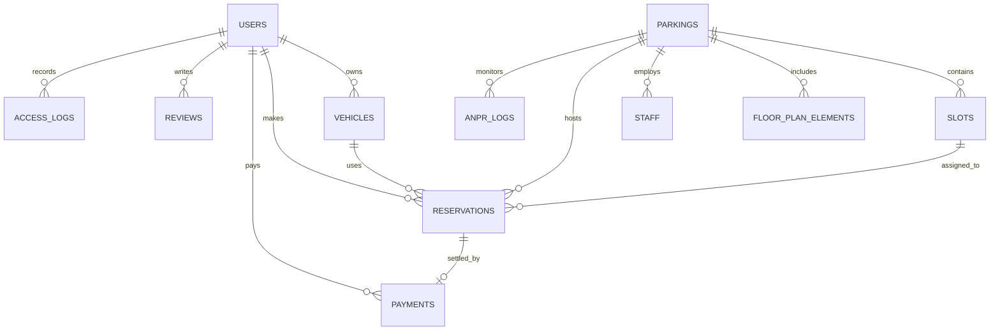

# 05 → Modelo de Datos (Diagrama ER y Tablas PostgreSQL)

## Diagrama Entidad-Relación (ER)

---

## Esquema Detallado de Tablas PostgreSQL

### 1. Tabla `users`
| Columna | Tipo | Restricciones | Descripción |
|---|---|---|---|
| `id` | UUID / INT | PRIMARY KEY, AUTO_INC | Identificador único |
| `full_name` | VARCHAR(150) | NOT NULL | Nombre completo |
| `email` | VARCHAR(150) | UNIQUE, NOT NULL | Correo electrónico |
| `phone` | VARCHAR(30) | NULLABLE | Teléfono |
| `hashed_password`| VARCHAR(255) | NOT NULL | Clave encriptada bcrypt |
| `security_pin` | VARCHAR(255) | NULLABLE | PIN de seguridad encriptado |
| `role` | VARCHAR(20) | DEFAULT 'user' | Rol (`user`, `local`, `platform`) |
| `is_active` | BOOLEAN | DEFAULT TRUE | Estado |
| `created_at` | TIMESTAMP | DEFAULT CURRENT_TIMESTAMP | Fecha de registro |

---

### 2. Tabla `vehicles`
| Columna | Tipo | Restricciones | Descripción |
|---|---|---|---|
| `id` | INT | PRIMARY KEY, AUTO_INC | ID del vehículo |
| `user_id` | INT | FOREIGN KEY (users.id) | Propietario |
| `license_plate` | VARCHAR(20) | NOT NULL | Placa de matrícula |
| `vehicle_type` | VARCHAR(20) | NOT NULL | Tipo (`auto`, `moto`, `suv`, `truck`, `bike`) |
| `brand` | VARCHAR(50) | NULLABLE | Marca |
| `model` | VARCHAR(50) | NULLABLE | Modelo |
| `color` | VARCHAR(30) | NULLABLE | Color |

---

### 3. Tabla `parkings`
| Columna | Tipo | Restricciones | Descripción |
|---|---|---|---|
| `id` | INT | PRIMARY KEY, AUTO_INC | ID del establecimiento |
| `name` | VARCHAR(150) | NOT NULL | Nombre del local |
| `address` | VARCHAR(255) | NOT NULL | Dirección |
| `city` | VARCHAR(100) | NOT NULL | Ciudad / Distrito |
| `latitude` | FLOAT | NOT NULL | Latitud GPS |
| `longitude` | FLOAT | NOT NULL | Longitud GPS |
| `hourly_rate` | DECIMAL(10,2) | NOT NULL | Tarifa base por hora |
| `tolerance_minutes` | INT | DEFAULT 15 | Minutos de gracia sin cobro |
| `status` | VARCHAR(20) | DEFAULT 'active' | Estado (`active`, `maintenance`, `suspended`) |
| `total_capacity` | INT | DEFAULT 0 | Número total de cajones |

---

### 4. Tabla `slots` (Cajones / Plazas)
| Columna | Tipo | Restricciones | Descripción |
|---|---|---|---|
| `id` | INT | PRIMARY KEY, AUTO_INC | ID del cajón |
| `parking_id` | INT | FOREIGN KEY (parkings.id) | Local al que pertenece |
| `code` | VARCHAR(20) | NOT NULL | Código visible (ej. A-01) |
| `floor_level` | VARCHAR(20) | DEFAULT 'Piso 1' | Nivel / Piso |
| `slot_type` | VARCHAR(20) | DEFAULT 'auto' | Tipo (`auto`, `moto`, `pmr`, `ev`) |
| `status` | VARCHAR(20) | DEFAULT 'free' | Estado (`free`, `occupied`, `reserved`, `disabled`) |
| `pos_x` | INT | DEFAULT 0 | Coordenada X en plano Canvas |
| `pos_y` | INT | DEFAULT 0 | Coordenada Y en plano Canvas |
| `width` | INT | DEFAULT 60 | Ancho en Canvas |
| `height` | INT | DEFAULT 100 | Alto en Canvas |
| `rotation` | INT | DEFAULT 0 | Ángulo de rotación (0, 90, 180, 270) |

---

### 5. Tabla `floor_plan_elements` (Elementos Decorativos Canva)
| Columna | Tipo | Restricciones | Descripción |
|---|---|---|---|
| `id` | INT | PRIMARY KEY, AUTO_INC | ID del objeto gráfico |
| `parking_id` | INT | FOREIGN KEY (parkings.id) | Local |
| `element_type` | VARCHAR(30) | NOT NULL | Tipo (`wall`, `crosswalk`, `text`, `arrow`, `gate`) |
| `pos_x` | INT | NOT NULL | Coordenada X |
| `pos_y` | INT | NOT NULL | Coordenada Y |
| `width` | INT | NOT NULL | Ancho |
| `height` | INT | NOT NULL | Alto |
| `rotation` | INT | DEFAULT 0 | Rotación |
| `z_index` | INT | DEFAULT 1 | Capa de profundidad |
| `properties_json`| TEXT | NULLABLE | Propiedades extra (colores, franjas) |

---

### 6. Tabla `reservations`
| Columna | Tipo | Restricciones | Descripción |
|---|---|---|---|
| `id` | INT | PRIMARY KEY, AUTO_INC | ID de reserva |
| `code` | VARCHAR(50) | UNIQUE, NOT NULL | Código único (ej. RSV-8912) |
| `user_id` | INT | FOREIGN KEY (users.id) | Usuario |
| `parking_id` | INT | FOREIGN KEY (parkings.id) | Local |
| `slot_id` | INT | FOREIGN KEY (slots.id) | Cajón asignado |
| `license_plate` | VARCHAR(20) | NOT NULL | Placa del vehículo |
| `start_time` | TIMESTAMP | NOT NULL | Hora de inicio programada |
| `end_time` | TIMESTAMP | NOT NULL | Hora de fin programada |
| `actual_entry` | TIMESTAMP | NULLABLE | Hora de ingreso real ANPR/Garita |
| `actual_exit` | TIMESTAMP | NULLABLE | Hora de salida real ANPR/Garita |
| `total_cost` | DECIMAL(10,2) | NOT NULL | Monto liquidado |
| `status` | VARCHAR(20) | DEFAULT 'scheduled' | Estado (`scheduled`, `active`, `completed`, `cancelled`) |
| `qr_code` | VARCHAR(255) | NOT NULL | Token / Cadena QR |

---

### 7. Tabla `payments`
| Columna | Tipo | Restricciones | Descripción |
|---|---|---|---|
| `id` | INT | PRIMARY KEY, AUTO_INC | ID del pago |
| `reservation_id`| INT | FOREIGN KEY (reservations.id) | Reserva ligada |
| `user_id` | INT | FOREIGN KEY (users.id) | Pagador |
| `amount` | DECIMAL(10,2) | NOT NULL | Monto pagado |
| `payment_method` | VARCHAR(30) | NOT NULL | Método (`card`, `yape`, `plin`, `qr_transfer`) |
| `receipt_type` | VARCHAR(20) | DEFAULT 'boleta' | Comprobante (`boleta`, `factura`) |
| `coupon_applied`| VARCHAR(50) | NULLABLE | Código de descuento |
| `status` | VARCHAR(20) | DEFAULT 'completed' | Estado (`completed`, `refunded`, `failed`) |
| `created_at` | TIMESTAMP | DEFAULT CURRENT_TIMESTAMP | Fecha de transacción |

---

### 8. Tabla `staff`
| Columna | Tipo | Restricciones | Descripción |
|---|---|---|---|
| `id` | INT | PRIMARY KEY, AUTO_INC | ID del empleado |
| `parking_id` | INT | FOREIGN KEY (parkings.id) | Local |
| `full_name` | VARCHAR(150) | NOT NULL | Nombre |
| `dni` | VARCHAR(20) | NOT NULL | Documento de Identidad |
| `position` | VARCHAR(50) | NOT NULL | Cargo (`Operador Garita`, `Supervisor`, `Seguridad`) |
| `shift` | VARCHAR(30) | DEFAULT 'Mañana' | Turno (`Mañana`, `Tarde`, `Noche`, `24h`) |
| `status` | VARCHAR(20) | DEFAULT 'active' | Estado (`active`, `inactive`) |
