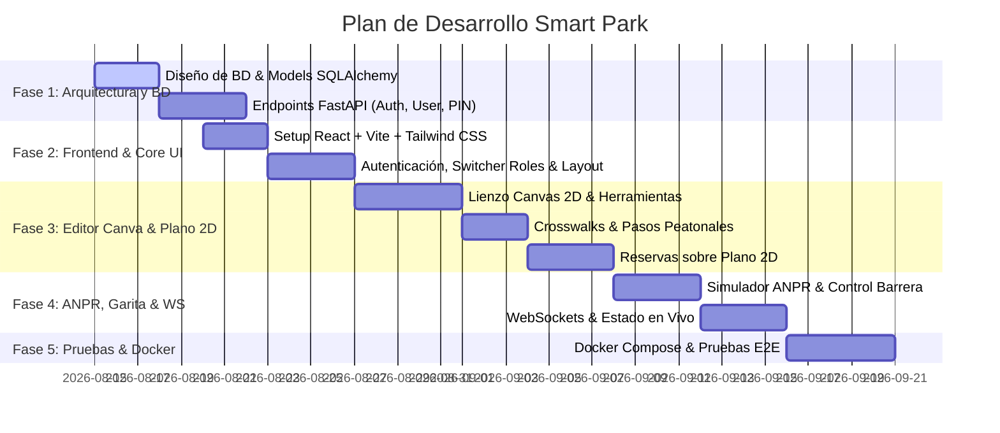

# 08 → Roadmap y Plan de Implementación

## Plan de Fases de Desarrollo

---

## Hitos Entregables

1. **Hito 1 — Documentación Integral (100% Completado):**
   - Especificación completa de requerimientos (RF01-RF192), modelos de datos, arquitectura, contratos de API y prototipos UI en la carpeta `/Sistema de Estacionamiento`.

2. **Hito 2 — Backend FastAPI + PostgreSQL:**
   - Estructura limpia modular, endpoints REST v1, WebSockets nativos y persistencia con SQLAlchemy Async.

3. **Hito 3 — Frontend React + Tailwind CSS + Editor Canva:**
   - Interfaz responsive multi-perfil, soporte para PIN Keypad virtual, mapa interactivo y editor gráfico de planos 2D con pasos peatonales (*crosswalks*).

4. **Hito 4 — Módulo ANPR, Garita & WebSockets:**
   - Simulación de lectura de matrículas, apertura automática de talanquera y sincronización instantánea de ocupación de cajones.

5. **Hito 5 — Empaquetamiento Docker & Docker Compose:**
   - Despliegue con un solo comando (`docker-compose up --build`) para desarrollo y producción.