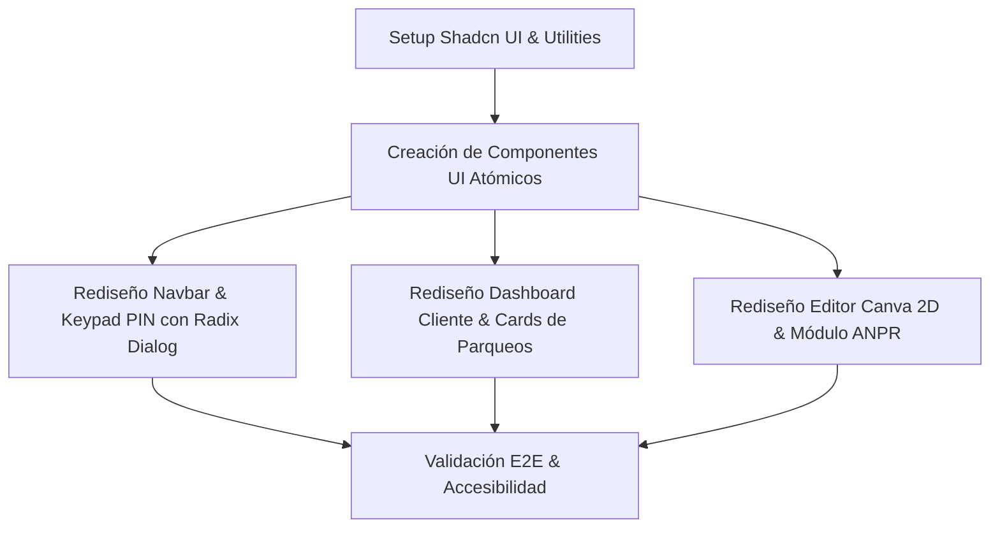

# Plan Maestro de Rediseño UI/UX y Sistema de Componentes Shadcn UI — Smart Park

> **Objetivo:** Transformar la experiencia visual e interactiva de **Smart Park** a una interfaz de estándar SaaS internacional (*Enterprise Grade*), utilizando el sistema de componentes **Shadcn UI** (Radix UI primitives + Tailwind CSS), asegurando la mayor accesibilidad (WCAG 2.1), micro-animaciones fluidas y jerarquía visual impecable.

---

## 📐 1. Diagnóstico UX y Principios de Diseño Propuestos

### 1.1 Diagnóstico de Puntos de Mejora en la Interfaz Actual
1. **Falta de componentes atómicos estandarizados:** Modales, popovers, selectores y pestañas creados de forma ad-hoc sin un sistema de diseño rígido.
2. **Paciencia y Accesibilidad (a11y):** Los diálogos y modales carecen de foco atrapado (*focus-trap*), soporte nativo para `Esc` y gestión de lector de pantalla (Screen Reader) con atributos ARIA.
3. **Consistencia de Color y Estados:** Necesidad de utilizar un sistema de variables CSS dinámicas para `primary`, `secondary`, `accent`, `destructive`, `muted` y `card` al estilo de Shadcn UI.
4. **Respuesta Visual y Micro-interacciones:** Incorporación de animaciones suaves en transiciones entre roles, aperturas de modales y estados del plano 2D.

---

## 🎨 2. Design System & Design Tokens con Shadcn UI

Se establece la estructura de tokens basándonos en HSL / CSS Variables para integración nativa con Tailwind CSS:

```css
@layer base {
  :root {
    --background: 210 40% 98%;
    --foreground: 222.2 84% 4.9%;
    --card: 0 0% 100%;
    --card-foreground: 222.2 84% 4.9%;
    --popover: 0 0% 100%;
    --popover-foreground: 222.2 84% 4.9%;
    --primary: 160 84% 39%; /* Emerald SmartPark */
    --primary-foreground: 210 40% 98%;
    --secondary: 210 40% 96.1%;
    --secondary-foreground: 222.2 47.4% 11.2%;
    --muted: 210 40% 96.1%;
    --muted-foreground: 215.4 16.3% 46.9%;
    --accent: 172 66% 50%;
    --accent-foreground: 222.2 47.4% 11.2%;
    --destructive: 0 84.2% 60.2%;
    --destructive-foreground: 210 40% 98%;
    --border: 214.3 31.8% 91.4%;
    --input: 214.3 31.8% 91.4%;
    --ring: 160 84% 39%;
    --radius: 0.75rem;
  }
}
```

---

## 🧩 3. Arquitectura de Componentes Shadcn UI a Crear (`/src/components/ui`)

Crearemos la librería de componentes atómicos basados en `@radix-ui` y `class-variance-authority` (cva):

```text
src/components/ui/
├── button.jsx          # Botones con variantes (default, destructive, outline, secondary, ghost, link)
├── card.jsx            # Card, CardHeader, CardTitle, CardDescription, CardContent, CardFooter
├── dialog.jsx          # Modal con Radix Dialog (Focus-trap, Overlay, ARIA)
├── dropdown-menu.jsx   # Menú desplegable para perfiles y configuración
├── select.jsx          # Selector accesible de roles y vehículos
├── tabs.jsx            # Pestañas para navegación ("Buscar", "Mis Reservas", "Mis Vehículos")
├── badge.jsx           # Badges de estado ("Libre", "Ocupado", "Reservado", "ANPR OK")
├── input.jsx           # Input estilizado con foco reactivo
└── avatar.jsx          # Avatar de perfil de usuario
```

---

## 🛠️ 4. Plan de Rediseño por Pantallas y Módulos



### 4.1 Módulo Usuario Conductor
- **Cards de Parqueos:** Tarjetas con micro-efecto de hover, badge de disponibilidad y tarifa en destacado esmeralda.
- **Visualizador 2D de Plano:** Renderizado interactivo sobre tarjetas elevadas con tooltip reactivo y selección mediante Radix Dialog.
- **Pase QR Digital:** Modal flotante elegante con código QR enmarcado, temporizador y opción de descarga/impresión.

### 4.2 Módulo Administrador Local (Garita & Editor Canva)
- **Editor de Plano 2D:** Toolbar flotante moderna con botones icónicos Shadcn UI, controles de zoom/rotación y panel lateral desplegable para propiedades.
- **Cámara ANPR & Barrera:** Monitor con visor estilo cámara industrial moderna, log de capturas en tabla interactiva y badges de estado del sistema.

### 4.3 Módulo Administrador Plataforma
- **Dashboard de Métricas:** KPIs presentados en tarjetas métricas de alta densidad visual con gráficas y resúmenes ejecutivos.

---

## ⚡ 5. Fases de Ejecución Inmediata

1. **Fase 1:** Configurar utilidades `lib/utils.js` (cn helper con `clsx` y `tailwind-merge`).
2. **Fase 2:** Crear el kit de componentes `button`, `card`, `dialog`, `badge`, `tabs`, `input`, `select`.
3. **Fase 3:** Refactorizar y actualizar la aplicación principal [`App.jsx`](file:///D:/Escritorio/smart%20park/smart-park/frontend/src/App.jsx) incorporando la librería Shadcn UI.
4. **Fase 4:** Validar compilación, tiempos de respuesta e interacciones.
