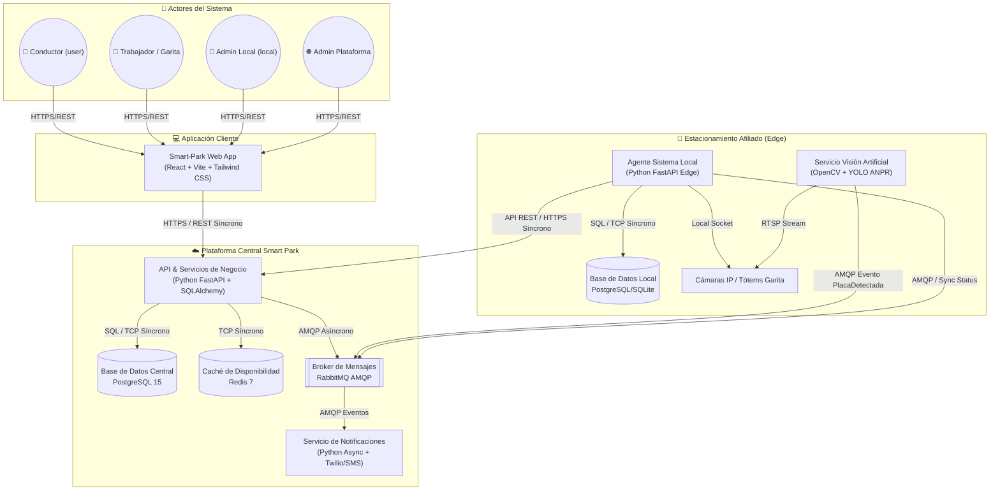
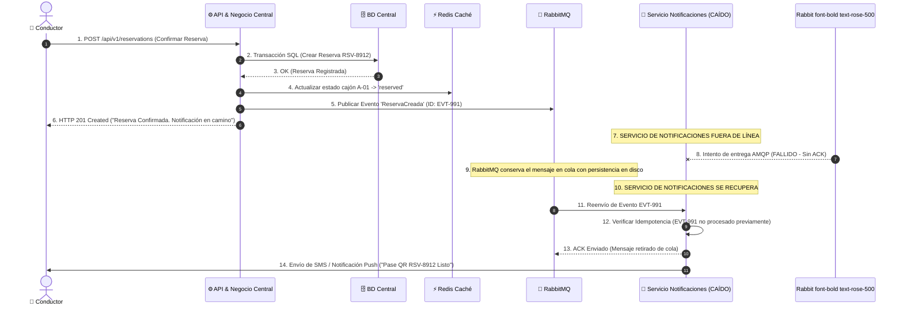

# 10 → Arquitectura C4, Decisiones y Escenario de Fallos

Este documento complementa la documentación técnica de **Smart Park** alineándose con el estándar C4 (Nivel 2 Contenedores), la Matriz de Decisiones Arquitectónicas (ADRs) y la Simulación Narrada de Escenarios de Fallo con Recuperación Asíncrona.

---

## 1. Diagrama C4 de Contenedores

El diagrama de contenedores muestra las aplicaciones, microservicios, brokers de eventos y bases de datos que conforman la plataforma **Smart Park**.

### 1.1. Resumen de Contenedores y Responsabilidades

| Contenedor / Componente | Responsabilidad Principal | Tecnología |
|---|---|---|
| **Aplicación Web Cliente** | Interfaz unificada responsiva (4 roles). | React + Vite + Tailwind CSS |
| **API & Servicios de Negocio** | Gestión de usuarios, reservas, pagos, tarifas, reseñas y reportes. | Python FastAPI + SQLAlchemy |
| **Servicio de Visión Artificial** | Reconocimiento de placas ANPR/LPR y bounding boxes. | Python + OpenCV + YOLO |
| **Servicio de Notificaciones** | Procesamiento asíncrono de alertas SMS/Push. | Python / FastAPI Async |
| **Agente Sistema Local (Edge)** | Autonomía operativa de garita ante desconexiones. | Python + FastAPI Edge |
| **Base de Datos Central** | Persistencia principal de toda la red. | PostgreSQL 15 |
| **Base de Datos Local (Edge)** | Almacenamiento temporal autónomo en cada parqueo. | PostgreSQL / SQLite |
| **Broker de Mensajes** | Desacoplamiento de eventos de negocio. | RabbitMQ (AMQP) |
| **Caché en Memoria** | Consultas ultra rápidas de plazas disponibles (< 3ms). | Redis 7 |

---

## 2. Tabla de Decisiones Arquitectónicas (ADR)

| Aspecto | Decisión Adoptada | Alternativa Considerada | Justificación | Riesgo y Medida de Control |
|---|---|---|---|---|
| **Estilo Arquitectónico** | Arquitectura distribuida (API Central + Agentes Locales Edge) | Monolito Centralizado | Permite a cada estacionamiento operar de forma autónoma en garita ante caídas de internet | Mayor complejidad operacional. Se automatiza con Docker Compose. |
| **Comunicación Síncrona** | API REST sobre HTTPS | Monolito con llamadas internas directas | Facilita la interoperabilidad entre Web App, Agentes Edge y API Central | Posibles timeouts en red. Se aplican reintentos y corta-circuitos. |
| **Comunicación Asíncrona** | RabbitMQ para eventos (`ReservaCreada`, `PlacaDetectada`) | Llamadas REST síncronas | Evita que el registro de una reserva dependa de que el Servicio de Notificaciones esté activo | Riesgo de duplicados. Se aplica idempotencia mediante UUIDs únicos. |
| **Gestión de Datos** | PostgreSQL Central + BD Local Edge por parqueo | Base de datos única compartida | Garantiza la continuidad operativa del negocio en cada local | Desincronización. Se sincroniza por ráfagas al restablecer conectividad. |
| **Consistencia** | Consistencia fuerte para reservas; consistencia eventual para notificaciones y reportes | Consistencia eventual total | Previene el doble arriendo o *overbooking* de una misma plaza | Mayor costo de bloqueo. Se optimiza en caché Redis con cierres atómicos. |
| **Seguridad** | Tokens JWT + PIN de Seguridad de 4 dígitos | Sesiones por Cookies en Servidor | Autenticación distribuida liviana entre cliente, API y agentes | Extracción de token. Expiración corta y PIN requerido para operaciones admin. |
| **Rendimiento** | Caché Redis para plazas libres | Consulta directa a PostgreSQL | Respuestas instantáneas (< 100ms en UI) para alta concurrencia de búsqueda | Caché desactualizada. Expiración corta (TTL 5s) y purga activa por evento. |

---

## 3. Escenario de Fallo Narrado y Recuperación

### 3.1. Síntesis del Comportamiento ante Fallos
* **Continuidad del Negocio:** El conductor reserva su lugar y obtiene su código QR **sin ser bloqueado** por la caída del proveedor de SMS.
* **Garantía de Idempotencia:** Al recuperarse el `Servicio de Notificaciones`, se evalúa el ID único del evento (`EVT-991`) evitando duplicidad de mensajes.
* **Cero Pérdida de Datos:** RabbitMQ persiste el evento en disco hasta recibir el `ACK` del consumidor.
