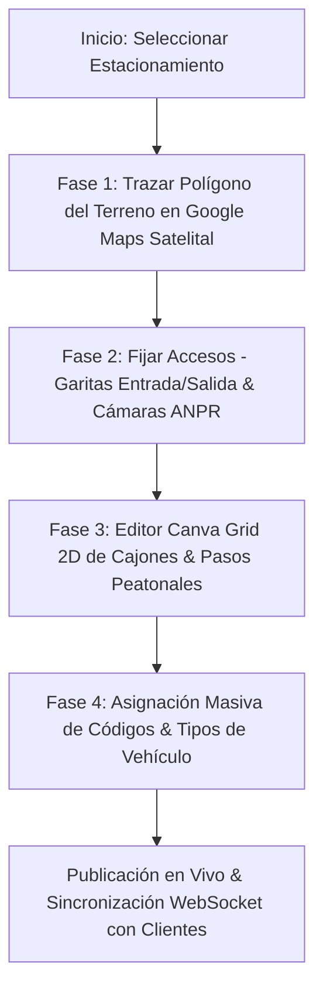

# Plan Maestro de Integración Profesional de Geodiseño de Estacionamientos (Plano 2D/3D & GIS)

> **Objetivo:** Definir e implementar el flujo estándar industrial para que el **Administrador Local** y el **Administrador de Plataforma** diseñen, acoten y georreferencien el terreno real de un estacionamiento sobre mapas satelitales/cadastrales (Google Maps / Mapbox / Canvas GIS 2D-3D).

---

## 🏗️ 1. Arquitectura de Geodiseño & Coordenadas Reales (GIS + CAD)

Para lograr un estándar profesional (*Enterprise Grade* estilo Tesla Supercharger, Airport Parking, o Westfield Mall), el terreno de un estacionamiento no debe ser un gráfico flotante abstracto, sino una **Capa Vectorial Georreferenciada (GIS Overlay)**.

### 1.1 Tres Niveles de Precisión Técnica
1. **Nivel 1 — Delimitación de Terreno (Geofencing Polygon):**
   - El administrador dibuja los vértices del terreno real (polígono de propiedad) directamente sobre la vista satelital (Google Maps Satellite / Hybrid).
   - Cálculo automático de área en m² y perímetro en metros.

2. **Nivel 2 — Puntos de Control y Orientación (North Alignment & Angle):**
   - Marcación de puertas de entrada/salida (Tótems con cámaras ANPR) y sentido de circulación vehicular.
   - Rotación y alineación del lienzo con el norte magnético o la línea de fachada del terreno.

3. **Nivel 3 — Maquetación Interna de Cajones y Peatones (Canva Grid & Layering):**
   - **Plazas de Parqueo:** Cajones estandarizados (Auto: 2.5m x 5.0m, Camioneta: 2.8m x 5.5m, Moto: 1.2m x 2.5m, PMR Inclusivo: 3.8m x 5.0m con franja azul).
   - **Pasos Peatonales (*Crosswalks*):** Franjas peatonales con textura de cebras blancas de alto contraste y delimitación de aceras.
   - **Isletas de Señalización & Paredes:** Obstáculos físicos con elevación Z-index y vías de circulación vehicular de un solo sentido / doble sentido.

---

## 🗺️ 2. Flujo UX Profesional para los Administradores



### 2.1 Herramientas del Editor Profesional de Terreno
- **Modo Trazado Poligonal (*Terrain Boundary Tool*):** Clics para agregar vértices GPS sobre el mapa satelital.
- **Herramienta de Bloques Masivos (*Grid Generator*):** Generación automática de una fila de 10 o 20 cajones paralelos o a 45°/60° con un solo arrastre.
- **Herramienta de Pasos Peatonales & Zonas de Tránsito:** Capa superior (Z-index 2) con texturas dinámicas de franjas peatonales.
- **Validador de Reglas de Negocio:**
  - Alerta si un cajón invade la vía de circulación o queda fuera del terreno.
  - Alerta si falta un paso peatonal de conexión hacia la salida.

---

## 🧩 3. Arquitectura de Datos de Terreno (`parkings` & `floor_plan_elements`)

Se extiende la entidad de datos para soportar la georreferenciación de vértices:

```json
{
  "parking_id": 1,
  "geo_bounds": [
    { "lat": -13.16061, "lng": -74.22572 },
    { "lat": -13.16095, "lng": -74.22580 },
    { "lat": -13.16102, "lng": -74.22540 },
    { "lat": -13.16068, "lng": -74.22532 }
  ],
  "total_area_m2": 1450.5,
  "slots": [
    { "code": "A-01", "slot_type": "auto", "pos_x": 50, "pos_y": 60, "width": 65, "height": 105, "rotation": 0 },
    { "code": "A-02", "slot_type": "pmr", "pos_x": 130, "pos_y": 60, "width": 80, "height": 105, "rotation": 0 }
  ],
  "elements": [
    { "element_type": "crosswalk", "pos_x": 50, "pos_y": 180, "width": 300, "height": 50, "properties": { "stripes": 8 } },
    { "element_type": "anpr_gate", "pos_x": 20, "pos_y": 20, "gate_type": "entry", "camera_ip": "192.168.1.100" }
  ]
}
```

---

## ⚡ 4. Plan de Implementación de la Vista de Geodiseño

1. **Creación del Componente `ProfessionalTerrainEditor.jsx`:**
   - Alternador de vistas (**Vista Satelital Terreno** vs **Lienzo de Diseño Interno 2D**).
   - Generador automático de cajones en bloque (Grid Generator).
   - Medidor de ocupación física en tiempo real m² vs cajones construidos.
2. **Integración con la vista de Admin Local y Admin Plataforma.**
3. **Validación de compilación sin errores.**
