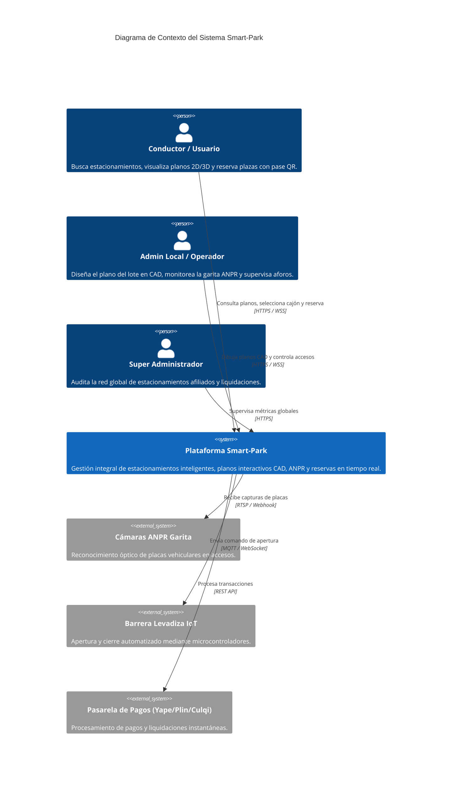
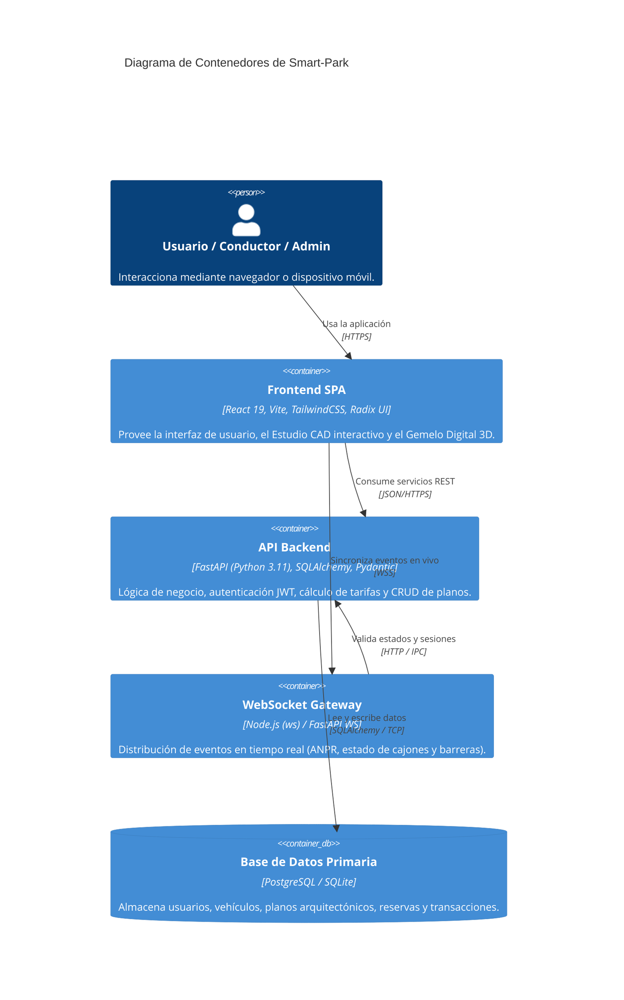
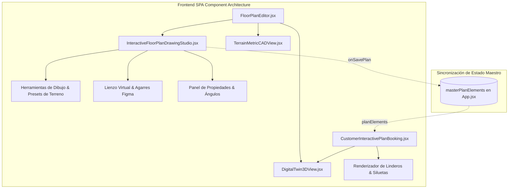

# Modelos de Arquitectura C4 - Smart-Park

## 1. Nivel 1: Diagrama de Contexto del Sistema

---

## 2. Nivel 2: Diagrama de Contenedores

---

## 3. Nivel 3: Diagrama de Componentes (Módulo de Diseño de Planos CAD)

