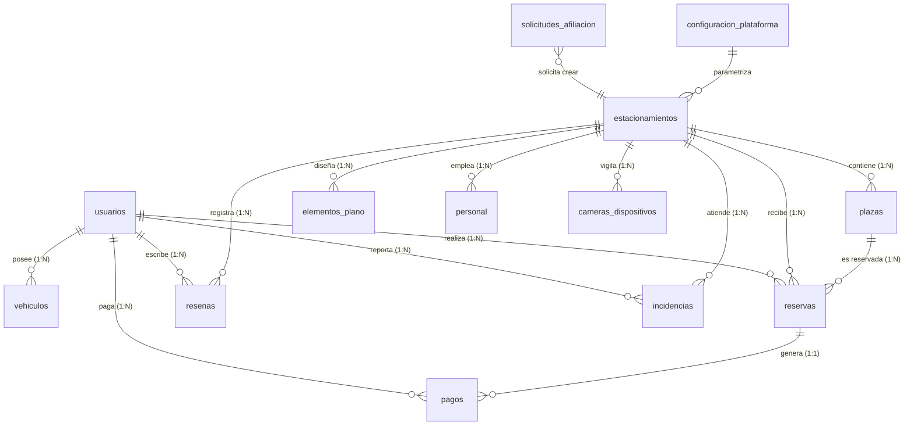

# 🗄️ Documentación Oficial del Esquema de Base de Datos — SMART-PARK

> **Motor:** `PostgreSQL 15 (Railway)` / `SQLite (dev)` · **ORM:** `SQLAlchemy 2.0` · **Tablas en español** · **v2026.08 — 12 tablas**

Este documento detalla la estructura física, relacional y lógica actual de la base de datos de **Smart-Park**. Incluye todas las tablas visibles en `backend/app/models/models.py:31` y su `postgresql_schema.sql`. Migraciones ligeras se aplican en `backend/app/main.py:54` (`ALTER TABLE ... IF NOT EXISTS`).

---

## 📐 Diagrama de Entidad-Relación (ERD)



---

## 📋 Diccionario de Datos por Tabla

### 1. `usuarios` — Cuentas y RBAC (`User` `models.py:31`)
| Campo | Tipo | Restricciones | Descripción |
| :--- | :--- | :--- | :--- |
| `id` | `INTEGER` | `PK AUTOINCREMENT` | Identificador. |
| `full_name` | `VARCHAR(150)` | `NOT NULL` | Nombre completo. |
| `email` | `VARCHAR(150)` | `NOT NULL UNIQUE INDEX` | Login. |
| `phone` | `VARCHAR(30)` | `NULLABLE` | Teléfono. |
| `hashed_password` | `VARCHAR(255)` | `NOT NULL` | Bcrypt. |
| `security_pin` | `VARCHAR(255)` | `DEFAULT '1234'` | PIN 4 dígitos hasheado (era `20` `FIX d73fa7d` `255`). |
| `role` | `VARCHAR(20)` | `NOT NULL DEFAULT 'user'` `CHECK user/local/platform` | RBAC. |
| `is_active` | `BOOLEAN` | `DEFAULT TRUE` | Suspendido. |
| `created_at` | `TIMESTAMP` | `DEFAULT NOW` | Alta. |
| **Índices** | | `idx_usuarios_email`, `idx_usuarios_role` | |

### 2. `vehiculos` — Padrón (`Vehicle` `models.py:47`)
| Campo | Tipo | Restricciones | Descripción |
| :--- | :--- | :--- | :--- |
| `id` | `INTEGER` | `PK` | ID vehículo. |
| `user_id` | `INTEGER` | `FK usuarios.id ON DELETE CASCADE` `INDEX` | Propietario. |
| `license_plate` | `VARCHAR(20)` | `NOT NULL INDEX` | Placa `AYC-501`. |
| `vehicle_type` | `VARCHAR(20)` | `DEFAULT 'auto'` `CHECK auto/moto/suv/truck/bike/pmr` | Tipo. |
| `brand` | `VARCHAR(50)` | `NULLABLE` | Marca. |
| `model` | `VARCHAR(50)` | `NULLABLE` | Modelo. |
| `color` | `VARCHAR(30)` | `NULLABLE` | Color. |

### 3. `estacionamientos` — Sedes (`Parking` `models.py:60`)
| Campo | Tipo | Restricciones | Descripción |
| :--- | :--- | :--- | :--- |
| `id` | `INTEGER` | `PK` | ID sede. |
| `name` | `VARCHAR(150)` | `NOT NULL` | Nombre comercial. |
| `address` | `VARCHAR(255)` | `NOT NULL` | Dirección. |
| `city` | `VARCHAR(100)` | `NOT NULL INDEX DEFAULT 'Ayacucho - Huamanga'` | Ciudad. |
| `latitude` | `DOUBLE` | `NOT NULL` | GPS lat. |
| `longitude` | `DOUBLE` | `NOT NULL` | GPS lng. |
| `hourly_rate` | `DOUBLE` | `NOT NULL DEFAULT 8.50` | Tarifa S/ hora. |
| `tolerance_minutes` | `INTEGER` | `DEFAULT 15` | Ventana llegada (gracia). |
| `status` | `VARCHAR(20)` | `DEFAULT 'active'` `CHECK active/inactive/maintenance` | Estado. |
| `total_capacity` | `INTEGER` | `DEFAULT 30` | Aforo. |
| `image_url` | `TEXT` | `NULLABLE` | Foto. |
| `description` | `TEXT` | `NULLABLE` `main.py:55` | Descripción. |
| `phone` | `VARCHAR(30)` | `NULLABLE` `main.py:56` | Teléfono sede. |
| `email` | `VARCHAR(150)` | `NULLABLE` `main.py:57` | Email sede. |
| `reference` | `VARCHAR(255)` | `NULLABLE` `main.py:58` | Referencia. |
| `level` | `VARCHAR(100)` | `NULLABLE` `main.py:59` | Nivel. |
| `camera_url` | `TEXT` | `NULLABLE` `main.py:60` | URL MJPEG/IP. |
| `camera_enabled` | `BOOLEAN` | `DEFAULT FALSE` `main.py:61` | Habilitada. |
| `camera_calibration` | `TEXT` | `NULLABLE` `main.py:62` | JSON `{x,y,w,h}` `0..1`. |
| **Índices** | | `idx_estacionamientos_city/status` | |

### 4. `plazas` — Cajones (`Slot` `models.py:106`)
| Campo | Tipo | Restricciones | Descripción |
| :--- | :--- | :--- | :--- |
| `id` | `INTEGER` | `PK` | ID plaza. |
| `parking_id` | `INTEGER` | `FK estacionamientos.id CASCADE` | Sede. |
| `code` | `VARCHAR(20)` | `NOT NULL` | `A-01` `B-02`. |
| `floor_level` | `VARCHAR(20)` | `DEFAULT 'Piso 1'` | Piso. |
| `slot_type` | `VARCHAR(20)` | `DEFAULT 'auto'` `CHECK` | `auto/moto/pmr` etc. |
| `status` | `VARCHAR(20)` | `DEFAULT 'free'` `CHECK free/occupied/reserved/disabled` | Estado. |
| `pos_x` | `INTEGER` | `DEFAULT 0` | X lienzo CAD `1100x700`. |
| `pos_y` | `INTEGER` | `DEFAULT 0` | Y. |
| `width` | `INTEGER` | `DEFAULT 60` | Ancho px. |
| `height` | `INTEGER` | `DEFAULT 100` | Alto px. |
| `rotation` | `INTEGER` | `DEFAULT 0` | Rotación `0-360`. |
| **Índices** | | `idx_plazas_parking_id/status` | |

### 5. `elementos_plano` — Infraestructura CAD (`FloorPlanElement` `models.py:123`)
| Campo | Tipo | Restricciones | Descripción |
| :--- | :--- | :--- | :--- |
| `id` | `INTEGER` | `PK` | ID elemento. |
| `parking_id` | `INTEGER` | `FK CASCADE` | Sede. |
| `element_type` | `VARCHAR(30)` | `NOT NULL` | `wall/crosswalk/gate/road/text`. |
| `pos_x` | `INTEGER` | `NOT NULL` | X. |
| `pos_y` | `INTEGER` | `NOT NULL` | Y. |
| `width` | `INTEGER` | `NOT NULL` | W. |
| `height` | `INTEGER` | `NOT NULL` | H. |
| `rotation` | `INTEGER` | `DEFAULT 0` | Rot. |
| `z_index` | `INTEGER` | `DEFAULT 1` | Capa. |
| `properties_json` | `TEXT` | `NULLABLE` | JSON extra. |

### 6. `reservas` — Pases (`Reservation` `models.py:139`)
| Campo | Tipo | Restricciones | Descripción |
| :--- | :--- | :--- | :--- |
| `id` | `INTEGER` | `PK` | ID. |
| `code` | `VARCHAR(50)` | `NOT NULL UNIQUE INDEX` `RSV-XXXXXX` | Ticket QR. |
| `user_id` | `INTEGER` | `FK usuarios.id CASCADE` | Conductor. |
| `parking_id` | `INTEGER` | `FK estacionamientos.id CASCADE` | Sede. |
| `slot_id` | `INTEGER` | `FK plazas.id CASCADE` | Cajón. |
| `license_plate` | `VARCHAR(20)` | `NOT NULL` | Placa. |
| `start_time` | `TIMESTAMP` | `NOT NULL` | Inicio `start = now + ETA`. |
| `end_time` | `TIMESTAMP` | `NOT NULL` | Fin `start + hours`. |
| `actual_entry` | `TIMESTAMP` | `NULLABLE` | Check-in garita. |
| `actual_exit` | `TIMESTAMP` | `NULLABLE` | Check-out. |
| `total_cost` | `DOUBLE` | `NOT NULL` | `hours * hourly_rate`. |
| `status` | `VARCHAR(20)` | `DEFAULT 'scheduled'` `CHECK scheduled/active/completed/cancelled` | Estado. |
| `qr_code` | `VARCHAR(255)` | `NOT NULL` | `SMARTPARK-RSV-...` para `QR`. |
| **Índices** | | `idx_reservas_code/user_id/parking_id` | |

> **Flujo:** `scheduled --check-in--> active --check-out--> completed` o `cancelled` por `reservation_worker.py:50` `deadline = start + tolerance` sin `check-in`.

### 7. `personal` — Operadores (`Staff` `models.py:158`)
| Campo | Tipo | Restricciones | Descripción |
| :--- | :--- | :--- | :--- |
| `id` | `INTEGER` | `PK` | ID. |
| `parking_id` | `INTEGER` | `FK estacionamientos.id CASCADE NOT NULL` | Sede asignada (única por trabajador). |
| `full_name` | `VARCHAR(150)` | `NOT NULL` | Nombre. |
| `dni` | `VARCHAR(20)` | `NOT NULL UNIQUE INDEX` `FIX c313c2f` | DNI. |
| `position` | `VARCHAR(50)` | `NOT NULL` | `Operador de Garita` etc. |
| `shift` | `VARCHAR(30)` | `DEFAULT 'Mañana'` | Turno. |
| `status` | `VARCHAR(20)` | `DEFAULT 'active'` | `active/inactive`. |
| `email` | `VARCHAR(150)` | `NULLABLE UNIQUE INDEX` | Login `local`. |
| `security_pin` | `VARCHAR(255)` | `DEFAULT '1234'` `d73fa7d` era `20` truncaba hash | PIN hasheado. |
| `created_at` | `TIMESTAMP` | `DEFAULT NOW` | Alta. |

### 8. `resenas` — Calificaciones (`Review` `models.py:172`)
| Campo | Tipo | Restricciones | Descripción |
| :--- | :--- | :--- | :--- |
| `id` | `INTEGER` | `PK` | ID. |
| `parking_id` | `INTEGER` | `FK CASCADE` | Sede. |
| `user_id` | `INTEGER` | `FK usuarios.id CASCADE` | Autor `user` único que puede escribir. |
| `user_name` | `VARCHAR(150)` | `NOT NULL` | Denormalizado. |
| `rating` | `INTEGER` | `1..5 DEFAULT 5` | Estrellas. |
| `comment` | `TEXT` | `NOT NULL` | Texto. |
| `response` | `TEXT` | `NULLABLE` | Réplica `local`. |
| `created_at` | `TIMESTAMP` | `DEFAULT NOW` | Fecha. |

### 9. `incidencias` — Reportes (`Incident` `models.py:184`)
| Campo | Tipo | Restricciones | Descripción |
| :--- | :--- | :--- | :--- |
| `id` | `INTEGER` | `PK` | ID. |
| `parking_id` | `INTEGER` | `FK CASCADE` | Sede. |
| `user_id` | `INTEGER` | `FK usuarios.id CASCADE` | Reportante. |
| `user_name` | `VARCHAR(150)` | `NOT NULL` | Nombre. |
| `category` | `VARCHAR(50)` | `DEFAULT 'general'` | `general/seguridad/infraestructura`. |
| `description` | `TEXT` | `NOT NULL` | Detalle. |
| `photo_url` | `TEXT` | `NULLABLE` | Foto. |
| `status` | `VARCHAR(20)` | `DEFAULT 'reported'` `CHECK reported/in_progress/resolved` | Estado. |
| `resolution_note` | `TEXT` | `NULLABLE` | Resolución `local/platform`. |
| `created_at` | `TIMESTAMP` | `DEFAULT NOW` | Creación. |
| `resolved_at` | `TIMESTAMP` | `NULLABLE` | Cierre. |

### 10. `pagos` — Pagos (`Payment` `models.py:215`)
| Campo | Tipo | Restricciones | Descripción |
| :--- | :--- | :--- | :--- |
| `id` | `INTEGER` | `PK` | ID. |
| `reservation_id` | `INTEGER` | `FK reservas.id NULLABLE INDEX` | Reserva pagada. |
| `user_id` | `INTEGER` | `FK usuarios.id INDEX NOT NULL` | Pagador. |
| `amount_cents` | `INTEGER` | `NOT NULL` | `S/ *100` `ej 1000 = 10.00`. |
| `currency` | `VARCHAR(10)` | `DEFAULT 'PEN'` | `PEN/USD`. |
| `status` | `VARCHAR(20)` | `DEFAULT 'succeeded'` | `succeeded/failed`. |
| `method` | `VARCHAR(30)` | `DEFAULT 'card'` | `cash/yape/plin/card/paypal`. |
| `culqi_charge_id` | `VARCHAR(100)` | `NULLABLE` | `tkn_...` o `PAYPAL-...`. |
| `description` | `VARCHAR(200)` | `NULLABLE` | Concepto. |
| `created_at` | `TIMESTAMP` | `DEFAULT NOW` | Fecha. |

### 11. `solicitudes_afiliacion` — Afiliaciones (`AffiliationRequest` `models.py:229`)
| Campo | Tipo | Restricciones | Descripción |
| :--- | :--- | :--- | :--- |
| `id` | `INTEGER` | `PK` | ID. |
| `parking_name` | `VARCHAR(150)` | `NOT NULL` | Nombre solicitado. |
| `owner_name` | `VARCHAR(150)` | `NOT NULL` | Dueño. |
| `email` | `VARCHAR(150)` | `NOT NULL` | Contacto. |
| `phone` | `VARCHAR(50)` | `NULLABLE` | Tel. |
| `address` | `VARCHAR(255)` | `NULLABLE` | Dirección. |
| `city` | `VARCHAR(100)` | `NULLABLE` | Ciudad. |
| `capacity` | `INTEGER` | `NULLABLE` | Aforo estimado. |
| `rate` | `DOUBLE` | `NULLABLE` | Tarifa propuesta. |
| `notes` | `TEXT` | `NULLABLE` | Notas. |
| `status` | `VARCHAR(20)` | `DEFAULT 'pending'` `CHECK pending/approved/rejected` | Estado. |
| `created_at` | `TIMESTAMP` | `DEFAULT NOW` | Solicitud. |

### 12. `configuracion_plataforma` — Ajustes globales (`PlatformSettings` `models.py:246`)
| Campo | Tipo | Restricciones | Descripción |
| :--- | :--- | :--- | :--- |
| `id` | `INTEGER` | `PK` | `1` único. |
| `data` | `TEXT` | `NOT NULL` | JSON `{commission, payment gateways, maintenance}`. |

### 13. `cameras_dispositivos` — Cámaras por sede (`CameraDevice` `models.py:89`)
| Campo | Tipo | Restricciones | Descripción |
| :--- | :--- | :--- | :--- |
| `id` | `INTEGER` | `PK` | ID. |
| `parking_id` | `INTEGER` | `FK estacionamientos.id INDEX NOT NULL` | Sede. |
| `name` | `VARCHAR(120)` | `NOT NULL DEFAULT 'Cámara 1'` | Nombre. |
| `url` | `TEXT` | `NOT NULL` | `http://.../video`. |
| `enabled` | `BOOLEAN` | `DEFAULT TRUE` | Habilitada. |
| `calibration` | `TEXT` | `NULLABLE` | JSON `{x,y,w,h}` `0..1`. |
| `created_at` | `TIMESTAMP` | `DEFAULT NOW` | Alta. |

---

## 🛠️ Migración y Ejecución

```bash
# PostgreSQL Railway (psql)
psql $DATABASE_URL -f backend/postgresql_schema.sql
# SQLite dev
sqlite3 smartpark_dev.db < backend/schema.sql
# Migración ligera en arranque main.py:54
# ALTER TABLE estacionamientos ADD COLUMN IF NOT EXISTS description TEXT, etc.
# ALTER TABLE personal ALTER COLUMN security_pin TYPE VARCHAR(255) (fix d73fa7d)
```

**Índices clave:** `usuarios(email,role)`, `vehiculos(user_id,license_plate)`, `estacionamientos(city,status)`, `plazas(parking_id,status)`, `reservas(code,user_id,parking_id)`, `personal(parking_id) + UNIQUE(dni,email)`, `pagos(reservation_id,user_id)`.

**FKs `ON DELETE CASCADE`:** `vehiculos/user_id`, `plazas/parking_id`, `reservas/user_id/parking_id/slot_id`, `personal/parking_id`, etc.

**Tamaño actual:** `12` tablas + `4` enums (`RoleEnum`, `VehicleTypeEnum`, `SlotStatusEnum`, `ReservationStatusEnum`).
