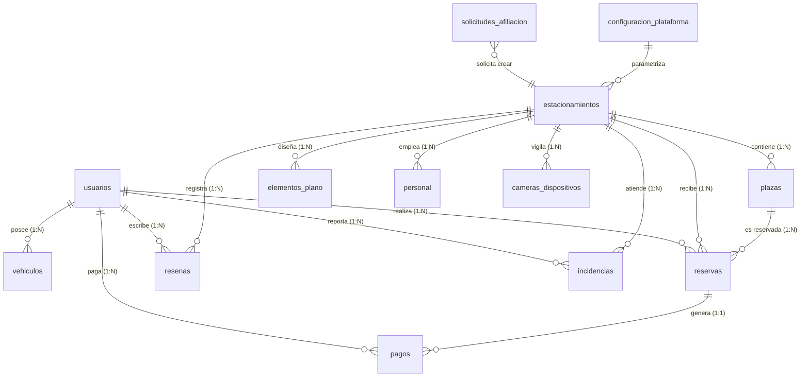

# 🗄️ Documentación Oficial del Esquema de Base de Datos — SMART-PARK

> **Motor:** `PostgreSQL (Local & Railway)` · **ORM:** `SQLAlchemy 2.0` · **Tablas en español** · **14 tablas nativas** (verificadas en desplegado `SELECT tablename FROM pg_tables WHERE schemaname='public'`)

Este documento detalla la estructura física, relacional y lógica actual de la base de datos de **Smart-Park**. Incluye todas las tablas visibles en `backend/app/models/models.py:31` y su `postgresql_schema.sql`. Migraciones ligeras se aplican en `backend/app/main.py:54` (`ALTER TABLE ... IF NOT EXISTS`).

---

## 📐 Diagrama de Entidad-Relación (ERD)



---

## 📋 Diccionario de Datos por Tabla

### 1. `usuarios` — Cuentas y RBAC (`User` `models.py:31`)
> **¿Para qué sirve?** Es la tabla madre de autenticación. Guarda a los 3 actores del marketplace: conductores (`user`) que reservan, dueños y operadores de cochera (`local`) que gestionan su sede asignada vía `Staff.parking_id`, y el super admin (`platform`) que aprueba afiliaciones y liquida. Cada fila genera un `JWT` `HS256` y un `PIN` de 4 dígitos hasheado para la garita. Ejemplo: `operador.garita@smartpark.pe / role local / PIN 2580` creado desde `StaffModule` con `parking_id=1`.
> **Flujo:** `POST /auth/register` → `POST /auth/login` (rate limit 5/min) → `GET /auth/me` valida `is_active`. Si `is_active=false` (personal eliminado) el login falla.

| Campo | Tipo | Restricciones | Descripción |
| :--- | :--- | :--- | :--- |
| `id` | `INTEGER` | `PK AUTOINCREMENT` | Identificador. |
| `full_name` | `VARCHAR(150)` | `NOT NULL` | Nombre completo. |
| `email` | `VARCHAR(150)` | `NOT NULL UNIQUE INDEX` | Login. |
| `phone` | `VARCHAR(30)` | `NULLABLE` | Teléfono. |
| `hashed_password` | `VARCHAR(255)` | `NOT NULL` | Bcrypt. |
| `security_pin` | `VARCHAR(255)` | `DEFAULT '1234'` | PIN 4 dígitos hasheado (era `20` `FIX d73fa7d` `255`). |
| `role` | `VARCHAR(20)` | `NOT NULL DEFAULT 'user'` `CHECK user/local/platform` | RBAC. |
| `is_active` | `BOOLEAN` | `DEFAULT TRUE` | Suspendido. |
| `created_at` | `TIMESTAMP` | `DEFAULT NOW` | Alta. |
| **Índices** | | `idx_usuarios_email`, `idx_usuarios_role` | |

### 2. `vehiculos` — Padrón (`Vehicle` `models.py:47`)
> Guarda los vehículos del conductor para autocompletar la placa al reservar. Un usuario puede tener N vehículos. Ejemplo: `ABC-123 Toyota RAV4 Gris` de `usuario@smartpark.com`. Solo el conductor usa `VehiclesModule`.

| Campo | Tipo | Restricciones | Descripción |
| :--- | :--- | :--- | :--- |
| `id` | `INTEGER` | `PK` | ID vehículo. |
| `user_id` | `INTEGER` | `FK usuarios.id ON DELETE CASCADE` `INDEX` | Propietario. |
| `license_plate` | `VARCHAR(20)` | `NOT NULL INDEX` | Placa `AYC-501`. |
| `vehicle_type` | `VARCHAR(20)` | `DEFAULT 'auto'` `CHECK auto/moto/suv/truck/bike/pmr` | Tipo. |
| `brand` | `VARCHAR(50)` | `NULLABLE` | Marca. |
| `model` | `VARCHAR(50)` | `NULLABLE` | Modelo. |
| `color` | `VARCHAR(30)` | `NULLABLE` | Color. |

### 3. `estacionamientos` — Sedes (`Parking` `models.py:60`)
> **¿Para qué sirve?** Representa cada sede física o cochera registrada en el sistema. Contiene información comercial, ubicación georreferenciada (latitud/longitud), tarifas horarias por categoría, tarifas por minuto, turno noche, abonos mensuales y fraccionados, switch maestro de abonos, capacidad total de aforo, tolerancias de tiempo y configuración ANPR.

| Campo | Tipo | Restricciones | Descripción |
| :--- | :--- | :--- | :--- |
| `id` | `INTEGER` | `PK` | ID sede. |
| `name` | `VARCHAR(150)` | `NOT NULL` | Nombre comercial. |
| `owner` | `VARCHAR(150)` | `NULLABLE` | Propietario o administrador legal. |
| `ruc` | `VARCHAR(20)` | `NULLABLE` | RUC fiscal de la cochera. |
| `address` | `VARCHAR(255)` | `NOT NULL` | Dirección física. |
| `city` | `VARCHAR(100)` | `NOT NULL INDEX DEFAULT 'Ayacucho - Huamanga'` | Ciudad. |
| `latitude` | `DOUBLE` | `NOT NULL` | GPS latitud. |
| `longitude` | `DOUBLE` | `NOT NULL` | GPS longitud. |
| `hourly_rate` | `DOUBLE` | `NOT NULL DEFAULT 5.00` | Tarifa base general por hora. |
| `tolerance_minutes` | `INTEGER` | `DEFAULT 15` | Ventana de llegada (tolerancia No-Show). |
| `status` | `VARCHAR(20)` | `DEFAULT 'active'` `CHECK active/inactive/maintenance` | Estado operativo. |
| `total_capacity` | `INTEGER` | `DEFAULT 30` | Capacidad máxima de aforo. |
| `image_url` | `TEXT` | `NULLABLE` | URL de fotografía de fachada. |
| `description` | `TEXT` | `NULLABLE` | Reseña o descripción comercial. |
| `phone` | `VARCHAR(30)` | `NULLABLE` | Teléfono fijo de contacto. |
| `whatsapp` | `VARCHAR(30)` | `NULLABLE` | Línea de atención WhatsApp. |
| `email` | `VARCHAR(150)` | `NULLABLE` | Email corporativo de la sede. |
| `reference` | `VARCHAR(255)` | `NULLABLE` | Referencia urbana. |
| `schedule` | `VARCHAR(120)` | `NULLABLE` | Horario de atención (ej. 24 Horas o 06:00-23:00). |
| `socials` | `TEXT` | `NULLABLE` | Enlaces a redes sociales de la cochera. |
| `maps_url` | `TEXT` | `NULLABLE` | Enlace a Google Maps para navegación GPS. |
| `rate_auto` | `FLOAT` | `DEFAULT 5.0` | Tarifa horaria para automóviles sedán/hatchback. |
| `rate_suv` | `FLOAT` | `DEFAULT 7.0` | Tarifa horaria para camionetas y SUVs. |
| `rate_mototaxi` | `FLOAT` | `DEFAULT 3.5` | Tarifa horaria para mototaxis. |
| `rate_moto` | `FLOAT` | `DEFAULT 2.5` | Tarifa horaria para motocicletas. |
| `billing_unit` | `VARCHAR(20)` | `DEFAULT 'hour'` | Unidad de facturación activa (`hour` / `minute`). |
| `rate_minute_auto` | `FLOAT` | `DEFAULT 0.08` | Tarifa por minuto para automóviles. |
| `rate_minute_suv` | `FLOAT` | `DEFAULT 0.12` | Tarifa por minuto para camionetas SUV. |
| `rate_minute_mototaxi`| `FLOAT` | `DEFAULT 0.06` | Tarifa por minuto para mototaxis. |
| `rate_minute_moto` | `FLOAT` | `DEFAULT 0.04` | Tarifa por minuto para motocicletas. |
| `rate_monthly_auto`| `FLOAT` | `DEFAULT 150.0` | Abono de 30 días para automóviles. |
| `rate_monthly_suv` | `FLOAT` | `DEFAULT 200.0` | Abono de 30 días para camionetas SUV. |
| `rate_monthly_mototaxi`| `FLOAT` | `DEFAULT 100.0` | Abono de 30 días para mototaxis. |
| `rate_monthly_moto`| `FLOAT` | `DEFAULT 70.0` | Abono de 30 días para motocicletas. |
| `rate_monthly` | `FLOAT` | `DEFAULT 150.0` | Abono mensual genérico de referencia. |
| `night_shift_enabled`| `BOOLEAN` | `DEFAULT FALSE` | Interruptor de tarificación nocturna. |
| `night_shift_start`| `VARCHAR(10)` | `DEFAULT '20:00'` | Inicio del turno nocturno. |
| `night_shift_end` | `VARCHAR(10)` | `DEFAULT '06:00'` | Fin del turno nocturno. |
| `night_shift_surcharge`| `FLOAT` | `DEFAULT 0.0` | Recargo adicional por hora nocturna. |
| `require_reservation_prepay`| `BOOLEAN` | `DEFAULT FALSE` | Exige prepago en línea obligatorio. |
| `subscription_enabled`| `BOOLEAN` | `DEFAULT TRUE` | **Switch Maestro de Abonos**: habilita/deshabilita suscripciones en la sede. |
| `custom_rates` | `TEXT` | `NULLABLE` | Padrón dinámico en JSON con tarifas personalizadas creadas por el Admin Local. |
| `camera_url` | `TEXT` | `NULLABLE` | Flujo de video IP/RTSP para reconocimiento ANPR. |
| `camera_enabled` | `BOOLEAN` | `DEFAULT FALSE` | Indicador de cámara de garita activa. |
| `camera_calibration` | `TEXT` | `NULLABLE` | Polígono de calibración del cuadro OCR en JSON `{x,y,w,h}`. |
| **Índices** | | `idx_estacionamientos_city/status` | |

### 4. `plazas` — Cajones (`Slot` `models.py:106`)
> **¿Para qué sirve?** Guarda cada cajón de estacionamiento individual dentro del plano interactivo CAD. Registra sus coordenadas vectoriales en el lienzo (`pos_x`, `pos_y`, `width`, `height`, `rotation`), nivel de piso, tipo de plaza y su estado en tiempo real (`free`, `occupied`, `reserved`, `disabled`).

| Campo | Tipo | Restricciones | Descripción |
| :--- | :--- | :--- | :--- |
| `id` | `INTEGER` | `PK` | ID plaza. |
| `parking_id` | `INTEGER` | `FK estacionamientos.id CASCADE` | Sede. |
| `code` | `VARCHAR(20)` | `NOT NULL` | `A-01` `B-02`. |
| `floor_level` | `VARCHAR(20)` | `DEFAULT 'Piso 1'` | Piso. |
| `slot_type` | `VARCHAR(20)` | `DEFAULT 'auto'` `CHECK` | `auto/moto/suv/truck/bike`. |
| `status` | `VARCHAR(20)` | `DEFAULT 'free'` `CHECK free/occupied/reserved/disabled` | Estado en tiempo real. |
| `pos_x` | `INTEGER` | `DEFAULT 0` | X lienzo CAD `1100x700`. |
| `pos_y` | `INTEGER` | `DEFAULT 0` | Y. |
| `width` | `INTEGER` | `DEFAULT 60` | Ancho px. |
| `height` | `INTEGER` | `DEFAULT 100` | Alto px. |
| `rotation` | `INTEGER` | `DEFAULT 0` | Rotación `0-360`. |
| **Índices** | | `idx_plazas_parking_id/status` | |

### 5. `elementos_plano` — Infraestructura CAD (`FloorPlanElement` `models.py:123`)
> **¿Para qué sirve?** Registra los elementos arquitectónicos e infraestructura del gemelo digital diseñados en el estudio CAD. Incluye muros perimetrales, vías de circulación, pasos peatonales (cebra), garitas ANPR y textos descriptivos con orden de capa (`z_index`).

| Campo | Tipo | Restricciones | Descripción |
| :--- | :--- | :--- | :--- |
| `id` | `INTEGER` | `PK` | ID elemento. |
| `parking_id` | `INTEGER` | `FK CASCADE` | Sede. |
| `element_type` | `VARCHAR(30)` | `NOT NULL` | `wall/crosswalk/gate/road/text`. |
| `pos_x` | `INTEGER` | `NOT NULL` | X. |
| `pos_y` | `INTEGER` | `NOT NULL` | Y. |
| `width` | `INTEGER` | `NOT NULL` | W. |
| `height` | `INTEGER` | `NOT NULL` | H. |
| `rotation` | `INTEGER` | `DEFAULT 0` | Rot. |
| `z_index` | `INTEGER` | `DEFAULT 1` | Capa. |
| `properties_json` | `TEXT` | `NULLABLE` | JSON extra. |

### 6. `reservas` — Pases (`Reservation` `models.py:139`)
> **¿Para qué sirve?** Gestiona el ciclo de vida completo de cada ticket, reserva regular o abono flexible (3 semanas, mensual, fraccionado). Almacena el código QR dinámico, horarios de inicio/fin, tolerancias No-Show, sobreestadía (*overtime*), montos pagados y estado operativo (`scheduled`, `active`, `completed`, `cancelled`).

| Campo | Tipo | Restricciones | Descripción |
| :--- | :--- | :--- | :--- |
| `id` | `INTEGER` | `PK` | ID reserva. |
| `code` | `VARCHAR(50)` | `NOT NULL UNIQUE INDEX` `RSV-XXXXXX` | Ticket QR único. |
| `user_id` | `INTEGER` | `FK usuarios.id CASCADE` | Conductor titular. |
| `parking_id` | `INTEGER` | `FK estacionamientos.id CASCADE` | Sede del aparcamiento. |
| `slot_id` | `INTEGER` | `FK plazas.id CASCADE` | Cajón asignado en plano CAD. |
| `license_plate` | `VARCHAR(20)` | `NOT NULL` | Placa vehicular normalizada. |
| `start_time` | `TIMESTAMP` | `NOT NULL` | Hora inicio programada (o actual). |
| `end_time` | `TIMESTAMP` | `NOT NULL` | Hora fin calculada según estancia o abono. |
| `actual_entry` | `TIMESTAMP` | `NULLABLE` | Marca de Check-In real en garita. |
| `actual_exit` | `TIMESTAMP` | `NULLABLE` | Marca de Check-Out real en garita. |
| `total_cost` | `DOUBLE` | `NOT NULL` | Importe total liquidado en Soles. |
| `amount_paid` | `DOUBLE` | `DEFAULT 0.0` | Monto pagado efectivamente (prepago o saldo). |
| `overtime_amount` | `DOUBLE` | `DEFAULT 0.0` | Importe acumulado por tiempo excedido (*overtime*). |
| `prepaid` | `BOOLEAN` | `DEFAULT FALSE` | Indicador de reserva prepagada en pasarela. |
| `origin` | `VARCHAR(30)` | `DEFAULT 'web'` | Origen de reserva (`web`, `garita`, `anpr`). |
| `status` | `VARCHAR(20)` | `DEFAULT 'scheduled'` `CHECK scheduled/active/completed/cancelled` | Estado operativo. |
| `subscription_days` | `INTEGER` | `NULLABLE` | Días contratados en abono (ej. 21, 30, o fraccionado). |
| `subscription_type` | `VARCHAR(50)` | `NULLABLE` | Tipo de abono (`"3_weeks"`, `"1_month"`, `"fractional"`). |
| `qr_code` | `VARCHAR(255)` | `NOT NULL` | Cadena serializada para renderizado QR. |
| **Índices** | | `idx_reservas_code/user_id/parking_id` | |

> **Flujo:** `scheduled --check-in--> active --check-out--> completed` o `cancelled` por `reservation_worker.py:50` `deadline = start + tolerance` sin `check-in`.

### 7. `personal` — Operadores (`Staff` `models.py:158`)
> **¿Para qué sirve?** Registra a los trabajadores y operadores de garita asignados a cada sede de estacionamiento. Asocia el DNI y credenciales de acceso local para que el personal pueda operar la garita y validar entradas/salidas de vehículos.

| Campo | Tipo | Restricciones | Descripción |
| :--- | :--- | :--- | :--- |
| `id` | `INTEGER` | `PK` | ID. |
| `parking_id` | `INTEGER` | `FK estacionamientos.id CASCADE NOT NULL` | Sede asignada (única por trabajador). |
| `full_name` | `VARCHAR(150)` | `NOT NULL` | Nombre. |
| `dni` | `VARCHAR(20)` | `NOT NULL UNIQUE INDEX` `FIX c313c2f` | DNI. |
| `position` | `VARCHAR(50)` | `NOT NULL` | `Operador de Garita` etc. |
| `shift` | `VARCHAR(30)` | `DEFAULT 'Mañana'` | Turno. |
| `status` | `VARCHAR(20)` | `DEFAULT 'active'` | `active/inactive`. |
| `email` | `VARCHAR(150)` | `NULLABLE UNIQUE INDEX` | Login `local`. |
| `security_pin` | `VARCHAR(255)` | `DEFAULT '1234'` `d73fa7d` era `20` truncaba hash | PIN hasheado. |
| `created_at` | `TIMESTAMP` | `DEFAULT NOW` | Alta. |

### 8. `resenas` — Calificaciones (`Review` `models.py:172`)
> **¿Para qué sirve?** Almacena las calificaciones (1 a 5 estrellas) y comentarios dejados por los conductores tras completar una estancia, así como las respuestas oficiales otorgadas por el administrador de la cochera.

| Campo | Tipo | Restricciones | Descripción |
| :--- | :--- | :--- | :--- |
| `id` | `INTEGER` | `PK` | ID. |
| `parking_id` | `INTEGER` | `FK CASCADE` | Sede. |
| `user_id` | `INTEGER` | `FK usuarios.id CASCADE` | Autor `user` único que puede escribir. |
| `user_name` | `VARCHAR(150)` | `NOT NULL` | Denormalizado. |
| `rating` | `INTEGER` | `1..5 DEFAULT 5` | Estrellas. |
| `comment` | `TEXT` | `NOT NULL` | Texto. |
| `response` | `TEXT` | `NULLABLE` | Réplica `local`. |
| `created_at` | `TIMESTAMP` | `DEFAULT NOW` | Fecha. |

### 9. `incidencias` — Reportes (`Incident` `models.py:184`)
> **¿Para qué sirve?** Sistema de tickets para el reporte y seguimiento de problemas ocurridos dentro del establecimiento (seguridad, infraestructura, fallos de pago o garita). Permite adjuntar fotos y registrar notas de resolución.

| Campo | Tipo | Restricciones | Descripción |
| :--- | :--- | :--- | :--- |
| `id` | `INTEGER` | `PK` | ID. |
| `parking_id` | `INTEGER` | `FK CASCADE` | Sede. |
| `user_id` | `INTEGER` | `FK usuarios.id CASCADE` | Reportante. |
| `user_name` | `VARCHAR(150)` | `NOT NULL` | Nombre. |
| `category` | `VARCHAR(50)` | `DEFAULT 'general'` | `general/seguridad/infraestructura`. |
| `description` | `TEXT` | `NOT NULL` | Detalle. |
| `photo_url` | `TEXT` | `NULLABLE` | Foto. |
| `status` | `VARCHAR(20)` | `DEFAULT 'reported'` `CHECK reported/in_progress/resolved` | Estado. |
| `resolution_note` | `TEXT` | `NULLABLE` | Resolución `local/platform`. |
| `created_at` | `TIMESTAMP` | `DEFAULT NOW` | Creación. |
| `resolved_at` | `TIMESTAMP` | `NULLABLE` | Cierre. |

### 10. `pagos` — Pagos (`Payment` `models.py:215`)
> **¿Para qué sirve?** Registra todas las transacciones financieras procesadas en la plataforma. Vincula las reservas con los cobros en pasarelas digitales (Culqi, PayPal, Yape/Plin) o pagos directos en efectivo realizados en la garita.

| Campo | Tipo | Restricciones | Descripción |
| :--- | :--- | :--- | :--- |
| `id` | `INTEGER` | `PK` | ID. |
| `reservation_id` | `INTEGER` | `FK reservas.id NULLABLE INDEX` | Reserva pagada. |
| `user_id` | `INTEGER` | `FK usuarios.id INDEX NOT NULL` | Pagador. |
| `amount_cents` | `INTEGER` | `NOT NULL` | `S/ *100` `ej 1000 = 10.00`. |
| `currency` | `VARCHAR(10)` | `DEFAULT 'PEN'` | `PEN/USD`. |
| `status` | `VARCHAR(20)` | `DEFAULT 'succeeded'` | `succeeded/failed`. |
| `method` | `VARCHAR(30)` | `DEFAULT 'card'` | `cash/yape/plin/card/paypal`. |
| `culqi_charge_id` | `VARCHAR(100)` | `NULLABLE` | `tkn_...` o `PAYPAL-...`. |
| `description` | `VARCHAR(200)` | `NULLABLE` | Concepto. |
| `created_at` | `TIMESTAMP` | `DEFAULT NOW` | Fecha. |

### 11. `solicitudes_afiliacion` — Afiliaciones (`AffiliationRequest` `models.py:229`)
> **¿Para qué sirve?** Almacena los formularios de solicitud enviados por dueños de cocheras interesadas en unirse a Smart-Park. Permite al superadministrador revisar, aprobar o rechazar nuevas sedes antes de integrarlas a la red.

| Campo | Tipo | Restricciones | Descripción |
| :--- | :--- | :--- | :--- |
| `id` | `INTEGER` | `PK` | ID. |
| `parking_name` | `VARCHAR(150)` | `NOT NULL` | Nombre solicitado. |
| `owner_name` | `VARCHAR(150)` | `NOT NULL` | Dueño. |
| `email` | `VARCHAR(150)` | `NOT NULL` | Contacto. |
| `phone` | `VARCHAR(50)` | `NULLABLE` | Tel. |
| `address` | `VARCHAR(255)` | `NULLABLE` | Dirección. |
| `city` | `VARCHAR(100)` | `NULLABLE` | Ciudad. |
| `capacity` | `INTEGER` | `NULLABLE` | Aforo estimado. |
| `rate` | `DOUBLE` | `NULLABLE` | Tarifa propuesta. |
| `notes` | `TEXT` | `NULLABLE` | Notas. |
| `status` | `VARCHAR(20)` | `DEFAULT 'pending'` `CHECK pending/approved/rejected` | Estado. |
| `created_at` | `TIMESTAMP` | `DEFAULT NOW` | Solicitud. |

### 12. `configuracion_plataforma` — Ajustes globales (`PlatformSettings` `models.py:246`)
> **¿Para qué sirve?** Tabla singleton (fila única `id=1`) que parametriza los ajustes globales de la plataforma, como porcentajes de comisión por reserva, estado de pasarelas de pago habilitadas y modo de mantenimiento.

| Campo | Tipo | Restricciones | Descripción |
| :--- | :--- | :--- | :--- |
| `id` | `INTEGER` | `PK` | `1` único. |
| `data` | `TEXT` | `NOT NULL` | JSON `{commission, payment gateways, maintenance}`. |

### 13. `cameras_dispositivos` — Cámaras por sede (`CameraDevice` `models.py:89`)
> **¿Para qué sirve?** Registra los dispositivos de cámara IP o streams MJPEG configurados en cada sede para la visión computacional YOLOv8 / OCR. Almacena la URL del stream, la calibración de la región de interés (ROI) y el estado de activación.

| Campo | Tipo | Restricciones | Descripción |
| :--- | :--- | :--- | :--- |
| `id` | `INTEGER` | `PK` | ID. |
| `parking_id` | `INTEGER` | `FK estacionamientos.id INDEX NOT NULL` | Sede. |
| `name` | `VARCHAR(120)` | `NOT NULL DEFAULT 'Cámara 1'` | Nombre. |
| `url` | `TEXT` | `NOT NULL` | `http://.../video`. |
| `enabled` | `BOOLEAN` | `DEFAULT TRUE` | Habilitada. |
| `calibration` | `TEXT` | `NULLABLE` | JSON `{x,y,w,h}` `0..1`. |
| `created_at` | `TIMESTAMP` | `DEFAULT NOW` | Alta. |

---

## 🛠️ Migración y Ejecución

```bash
# PostgreSQL Local & Railway (psql)
psql $DATABASE_URL -f backend/postgresql_schema.sql
# Migración ligera en arranque main.py (PostgreSQL)
# ALTER TABLE estacionamientos ADD COLUMN IF NOT EXISTS description TEXT, etc.
# ALTER TABLE personal ALTER COLUMN security_pin TYPE VARCHAR(255)
```

**Índices clave:** `usuarios(email,role)`, `vehiculos(user_id,license_plate)`, `estacionamientos(city,status)`, `plazas(parking_id,status)`, `reservas(code,user_id,parking_id)`, `personal(parking_id) + UNIQUE(dni,email)`, `pagos(reservation_id,user_id)`.

**FKs `ON DELETE CASCADE`:** `vehiculos/user_id`, `plazas/parking_id`, `reservas/user_id/parking_id/slot_id`, `personal/parking_id`, etc.

**Tamaño actual:** `13` tablas (`usuarios`, `vehiculos`, `estacionamientos`, `cameras_dispositivos`, `plazas`, `elementos_plano`, `reservas`, `personal`, `resenas`, `incidencias`, `pagos`, `solicitudes_afiliacion`, `configuracion_plataforma`) + `4` enums (`RoleEnum`, `VehicleTypeEnum`, `SlotStatusEnum`, `ReservationStatusEnum`).
