# 🅿️ Smart Park Ayacucho — Documentación Gráfica e Integral de Vistas

Documento técnico y visual que detalla la arquitectura, roles de usuario, vistas, componentes y funcionalidades de la plataforma **Smart Park Enterprise**, incluyendo capturas reales de cada módulo.

---

## 📑 Tabla de Contenidos
1. [Arquitectura de Roles y Accesos](#1-arquitectura-de-roles-y-accesos)
2. [Vistas Públicas (Sin Autenticación)](#2-vistas-públicas-sin-autenticación)
   - 2.1. Landing Page Principal (Hero, Red de Cocheras, Mapa y Footer)
   - 2.2. Modal de Autenticación & Acceso Rápido
   - 2.3. Verificación Pública de Pases QR (`/verify/:id`)
3. [Vistas del Rol Conductor (Usuario / Cliente)](#3-vistas-del-rol-conductor-usuario--cliente)
   - 3.1. Búsqueda de Cocheras & Mapa en Vivo
   - 3.2. Plano Topográfico & Reserva Interactiva de Cajón
   - 3.3. Pase de Acceso Digital QR
   - 3.4. Padrón de Mis Reservas
   - 3.5. Mis Vehículos & Reconocimiento LPR
   - 3.6. Métodos de Pago & Billeteras Digitales
   - 3.7. Reporte de Incidencias & Asistencia
   - 3.8. Historial de Estancias & Descarga de Boletas
   - 3.9. Reseñas y Calificaciones de Cocheras
   - 3.10. Perfil de Usuario & Preferencias
4. [Vistas del Rol Administrador de Cochera (Garita / Local)](#4-vistas-del-rol-administrador-de-cochera-garita--local)
   - 4.1. Panel de Espacios & Edición de Sede (4 Pestañas)
   - 4.2. Estudio de Dibujo y Edición del Plano (CAD Studio)
   - 4.3. Control de Garita & Lector LPR Inteligente
   - 4.4. Directorio de Personal & Turnos
   - 4.5. Reportes de Ocupación & Rendimiento
   - 4.6. Diagnóstico y Resiliencia de Servicios
5. [Vistas del Rol Super Administrador de Plataforma (Platform)](#5-vistas-del-rol-super-administrador-de-plataforma-platform)
   - 5.1. Dashboard Global de la Red
   - 5.2. Finanzas & Liquidaciones por Sede
   - 5.3. Afiliación & Auditoría de Sedes
   - 5.4. Gestión de Usuarios & Permisos RBAC
   - 5.5. Ajustes Globales de Plataforma
6. [Diseño Responsivo & Reglas de Estilo](#6-diseño-responsivo--reglas-de-estilo)

---

## 1. Arquitectura de Roles y Accesos

El sistema opera bajo un esquema de **Control de Acceso Basado en Roles (RBAC)** con 3 perfiles principales:

| Rol | Identificador | Público Objetivo | Capacidades Principales |
| :--- | :---: | :--- | :--- |
| **Conductor** | `user` | Clientes y conductores en Ayacucho | Buscar cocheras, ver mapa satelital, elegir cajón en plano, reservar, emitir pases QR, gestionar vehículos, pagar con Yape/Plin/Tarjeta y reportar incidencias. |
| **Administrador de Cochera** | `local` | Dueños de garita y operadores | Editar sede (datos, fotos, mapa, redes), diseñar plano arquitectónico, monitorear cámara LPR, abrir barrera, emitir tickets presenciales y gestionar personal. |
| **Super Administrador** | `platform` | Administradores de la red Smart Park | Supervisión de todas las sedes en Ayacucho, recaudación financiera global, métricas de ocupación, comisiones, personal y auditoría. |

---

## 2. Vistas Públicas (Sin Autenticación)

### 2.1. Landing Page Principal (`LandingPage.jsx`)
* **Propósito:** Página de inicio y presentación corporativa orientada a conductores y dueños de playas de estacionamiento en Ayacucho.
* **Componentes Principales:**
  - **Banner Superior (Hero):** Título principal, estadísticas en tiempo real (Cocheras activas, Plazas libres, Tiempo de reserva < 30s) y botón de búsqueda directa.
  - **Buscador & Filtros en Vivo:** Filtro por zonas clave de Ayacucho (*Centro Histórico, Jr. Bellido, Mercado Cáceres, Terminal Libertadores*).
  - **Mapa Interactivo de Sedes (`AyacuchoMap.jsx`):** Vista geográfica con pines interactivos que muestran tarifas por hora y estado de ocupación.
  - **Tarjetas de Cocheras:** Listado con foto en encuadre 16:9, tarifa en Nuevos Soles (ej. `S/ 5.00/h`), distancia estimada y botón *"Ver Plano & Reservar"*.
  - **Pilares Tecnológicos:** Secciones explicativas sobre lectura automática de placas LPR, pagos sin contacto y seguridad 24/7.
  - **Footer Institucional:** Enlaces directos a Términos y Condiciones Legales, contacto y soporte por WhatsApp.

#### 📸 Capturas de la Landing Page:

**Hero Principal & Buscador:**
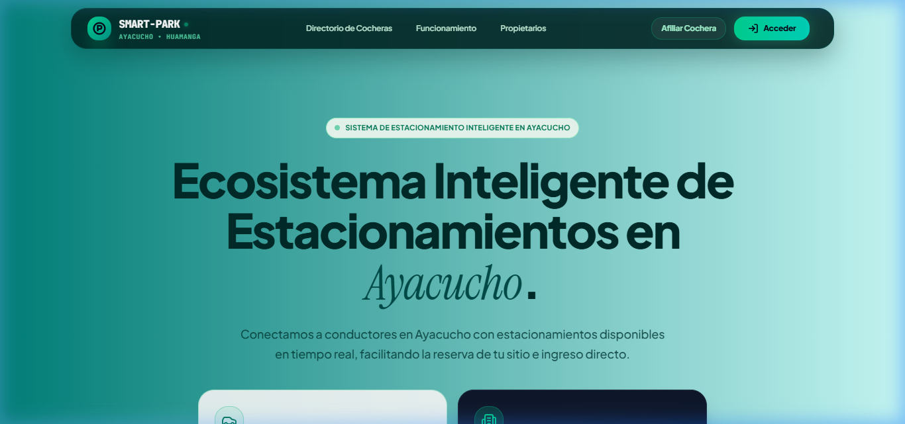

**Red de Cocheras & Mapa Interactivo en Ayacucho:**
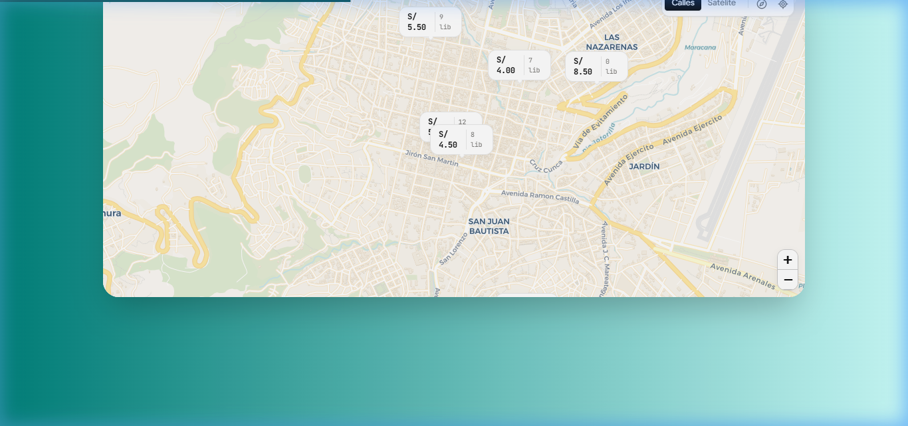

**Pilares Tecnológicos & Beneficios:**
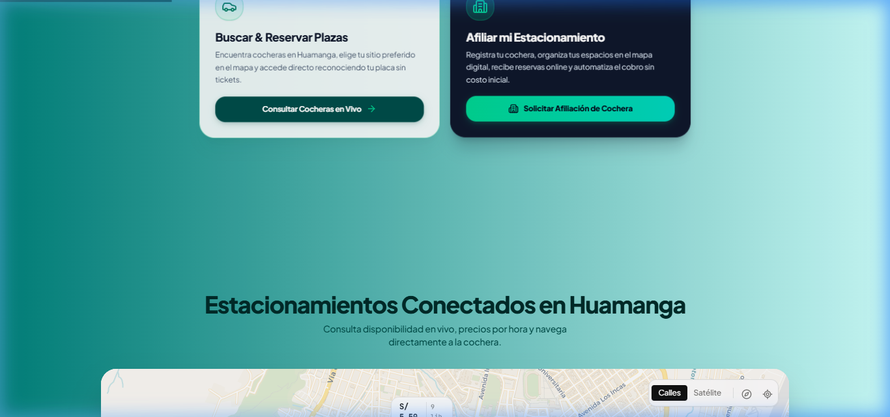

**Preguntas Frecuentes & Pie de Página Institucional:**
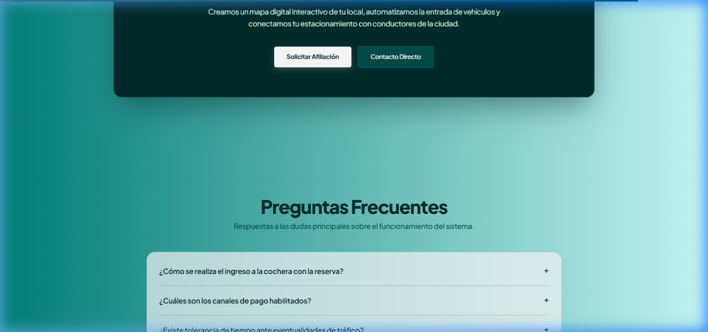

---

### 2.2. Modal de Autenticación & Acceso Rápido (`LoginAuthScreen.jsx`)
* **Propósito:** Acceso seguro con estándares modernos de autenticación.
* **Características:**
  - **Google One-Tap / OAuth:** Inicio de sesión en 1 clic mediante credencial JWT oficial.
  - **Acceso Tradicional:** Correo electrónico y contraseña con validación contra el servidor backend FastAPI / PostgreSQL (Railway).
  - **Selector Rápido de Roles (Desarrollo/Demo):** Botones directos para alternar entre *Conductor*, *Administrador Local* y *Super Admin*.

#### 📸 Captura del Modal de Autenticación:
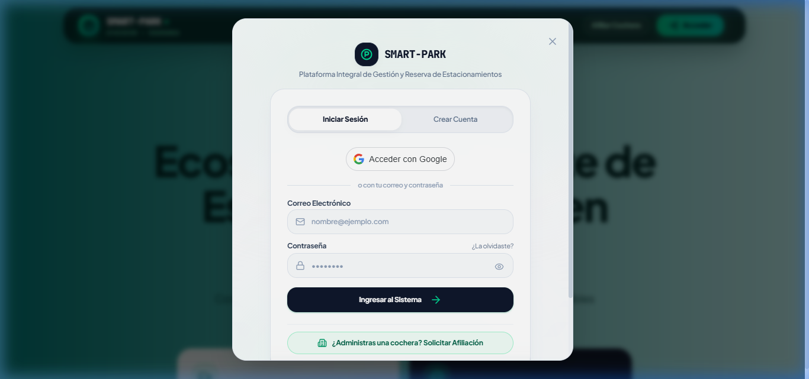

---

### 2.3. Verificación Pública de Pases QR (`VerifyReservationPage.jsx`)
* **Ruta:** `/verify/:id` (ej. `/verify/RSV-8912`).
* **Propósito:** Página pública ligera diseñada para ser leída por cualquier escáner móvil o cámara de celular (Google Lens).
* **Contenido:**
  - Muestra en tiempo real si el pase está **Válido / En Estancia / Finalizado**.
  - Datos de placa, cajón asignado, cochera y tiempo transcurrido.

---

## 3. Vistas del Rol Conductor (Usuario / Cliente)

### 3.1. Búsqueda de Cocheras & Mapa en Vivo (`App.jsx` + `AyacuchoMap.jsx`)
* **Propósito:** Dashboard principal del conductor para localizar estacionamientos disponibles cerca de su destino.
* **Funcionalidades:**
  - Búsqueda predictiva por nombre de calle, referencia o barrio en Huamanga.
  - Filtros rápidos: `Todos`, `Centro Histórico`, `Techados`, `Económicos (≤ S/ 4.50)`.
  - Tarjetas informativas con indicador de plazas libres y botón directo para ingresar al plano.

---

### 3.2. Plano Topográfico & Reserva Interactiva (`CustomerInteractivePlanBooking.jsx`)
* **Propósito:** Permite al cliente explorar visualmente la cochera en un plano arquitectónico y elegir su plaza exacta.
* **Componentes:**
  - **Lienzo Gráfico (Canvas):** Renderiza en tiempo real muros, carriles viales con flechas de sentido, pasos peatonales, cajones estándar y plazas techadas (`⛱️`).
  - **Interacción Táctil / Mouse:** Soporte de paneo (arrastrar) y zoom (+/-) adaptable a celulares y escritorios.
  - **Estado de Cajones:**
    - Verde: *Libre*.
    - Rojo: *Ocupado (con placa del auto estacionado)*.
    - Cyan Pulsante: *Seleccionado por el usuario*.
  - **Panel Lateral de Reserva:** Selector de vehículo registrado, duración estimada en horas (`1h`, `2h`, `4h`, `8h`), cálculo de tarifa y botón `[ Confirmar Reserva ]`.

#### 📸 Captura del Plano Topográfico Interactivo:
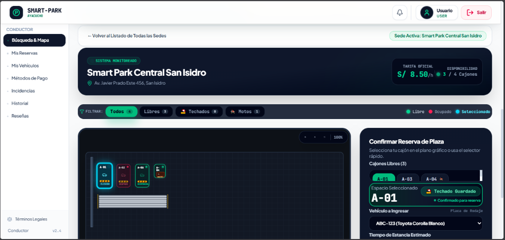

---

### 3.3. Pase de Acceso Digital QR (`DigitalAccessPassModal.jsx`)
* **Propósito:** Credencial digital generada al reservar para ingreso y salida en garita.
* **Elementos:**
  - Código QR de alta resolución con URL de verificación encriptada.
  - Temporizador de cuenta regresiva con tiempo restante de estancia.
  - Datos clave: Código de reserva (`RSV-XXXX`), Placa (`ABC-123`), Cajón (`A-01`) y Tarifa.
  - Botón directo para imprimir o descargar el comprobante.

#### 📸 Captura del Pase Digital QR:
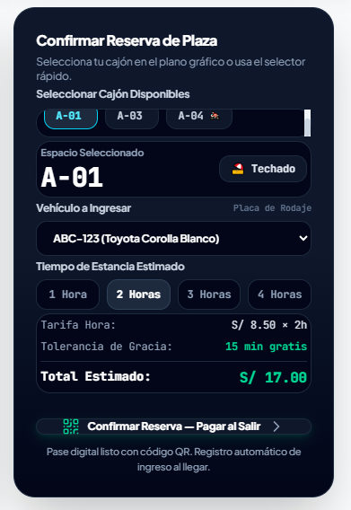

---

### 3.4. Padrón de Mis Reservas (`ReservationsModule.jsx`)
* **Propósito:** Gestión y seguimiento del historial de reservas del usuario.
* **Características:**
  - Pestañas de estado: `Todas`, `En Estancia (Activas)`, `Programadas`, `Finalizadas`, `Canceladas`.
  - Barra de progreso de tiempo transcurrido para estancias en curso.
  - Acceso inmediato al **Pase QR**, **Impresión de Ticket** o **Cancelación**.

#### 📸 Captura del Módulo de Reservas:
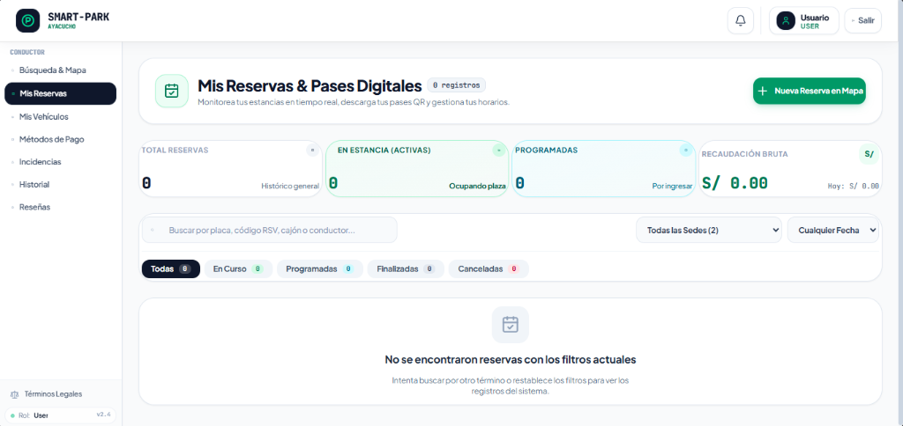

---

### 3.5. Mis Vehículos & Reconocimiento LPR (`VehiclesModule.jsx`)
* **Propósito:** Registro del parque automotor del conductor para permitir la apertura automática de barrera por LPR.
* **Características:**
  - Formato de placa peruana estandarizado (ej. `ABC-123` para autos, `1234-5A` para motos).
  - Consulta automática de foto oficial del vehículo (API Car Imagery) según marca y modelo (Toyota RAV4, Hyundai Tucson, etc.).
  - Opción de capturar foto con la cámara del dispositivo o subir desde la galería.
  - Selector de vehículo predeterminado para reservas rápidas.

#### 📸 Captura del Módulo de Vehículos:
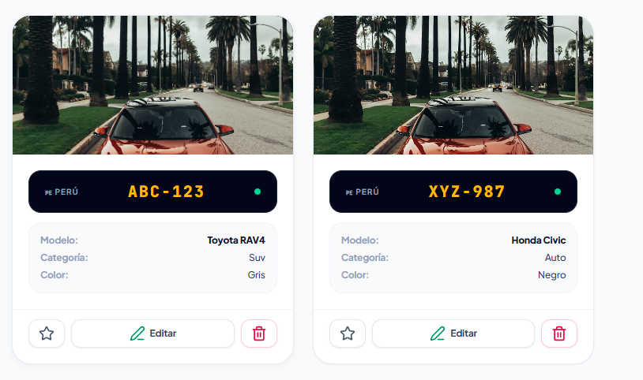

---

### 3.6. Métodos de Pago & Billeteras Digitales (`PaymentsModule.jsx`)
* **Propósito:** Configuración de medios de pago y consulta de comprobantes fiscales.
* **Características:**
  - **Billeteras Móviles (Yape & Plin):** Cobro instantáneo mediante código QR sin comisión.
  - **Tarjetas Tokenizadas (Visa / Mastercard):** Guardado seguro con tokenización.
  - **Comprobantes Electrónicos:** Registro de boletas y facturas emitidas bajo normativa SUNAT con botón para visualizar e imprimir comprobante.

#### 📸 Captura de Métodos de Pago en Móvil:
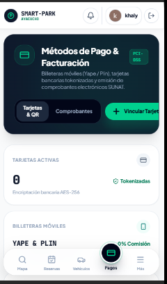

---

### 3.7. Reporte de Incidencias & Asistencia (`IncidentsModule.jsx`)
* **Propósito:** Canal de atención y reporte de problemas durante la estancia.
* **Categorías:** Cajón bloqueado, cobro indebido, daño vehicular, iluminación deficiente u otros.
* **Funcionalidad:** Adjuntar evidencia fotográfica (comprimida a dataURL) y seguimiento de respuesta de la administración.

---

### 3.8. Historial de Estancias & Descarga de Boletas (`HistoryModule.jsx`)
* **Propósito:** Padrón cronológico completo de todas las visitas realizadas con detalle de horas, montos pagados y comprobantes electrónicos PDF.

---

### 3.9. Reseñas y Calificaciones de Cocheras (`ReviewsModule.jsx`)
* **Propósito:** Evaluación de 1 a 5 estrellas y comentarios sobre la seguridad, limpieza y atención recibida en cada cochera.

---

### 3.10. Perfil de Usuario & Preferencias (`UserProfileModule.jsx`)
* **Propósito:** Actualización de datos de contacto, documento de identidad (DNI/RUC), configuración de notificaciones por WhatsApp/Email y gestión de seguridad.

---

## 4. Vistas del Rol Administrador de Cochera (Garita / Local)

### 4.1. Panel de Espacios & Edición de Sede (`LocalEstablishmentManager.jsx`)
Permite al propietario gestionar de forma integral su establecimiento mediante 4 pestañas estructuradas:

1. **1. Datos Generales & Tarifas:**
   - Nombre comercial de la cochera.
   - Nivel / Estructura (Nivel 1 Superficie, Sótano -1, Sótano -2, Playa Abierta).
   - Tarifa por hora con sugerencias rápidas (`S/ 3.00`, `S/ 5.00`, `S/ 8.00`, `S/ 10.00`).
   - Estado de operación: *Operativo (Abierto)*, *En Mantenimiento*, *Cerrado Temporalmente*.
   - Dirección física, referencia urbana y horario de atención (atajos: `24/7`, `06:00 AM - 10:00 PM`).
   - Titular, Razón Social y RUC.

2. **2. Ubicación & Mapa Interactivo (`LocationPickerMap`):**
   - Mini-mapa integrado con alternador de capas (*Calles* y *Satélite ESRI*).
   - Marcador pin arrastrable para fijar latitud y longitud exactas.
   - Buscador de calles en Ayacucho y presets rápidos (*Plaza Mayor, Jr. 28 de Julio, Mercado Cáceres, Terminal Libertadores, Jr. Bellido, San Juan Bautista*).
   - Conversor automático de enlaces compartidos de Google Maps a coordenadas GPS.

3. **3. Fotografía de la Sede:**
   - Vista previa con encuadre panorámico 16:9.
   - Subida directa de imágenes desde el dispositivo (hasta 6MB).
   - Galería de presets arquitectónicos de alta calidad.

4. **4. Contacto & Redes Sociales:**
   - Teléfono de atención, número de WhatsApp para reservas, correo electrónico y enlace de Google Maps / Waze.
   - Botones interactivos `[ Probar enlace ]` que abren chats reales de WhatsApp o páginas web en nuevas pestañas.

#### 📸 Capturas de Edición de Sede y Selector GPS:
**Pestañas de Edición de Sede:**
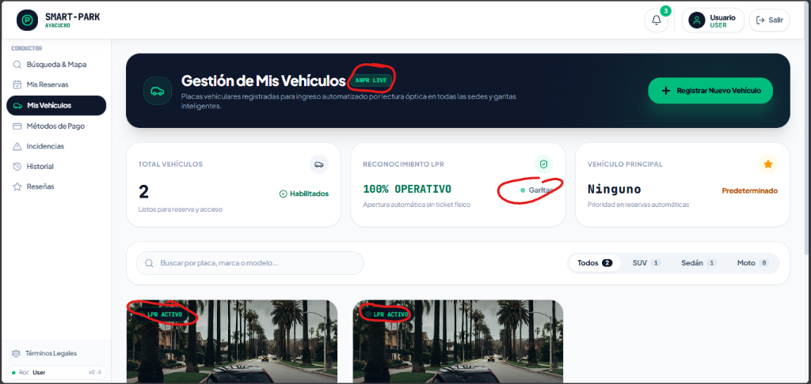

**Selector de Coordenadas GPS en Mapa Satelital:**
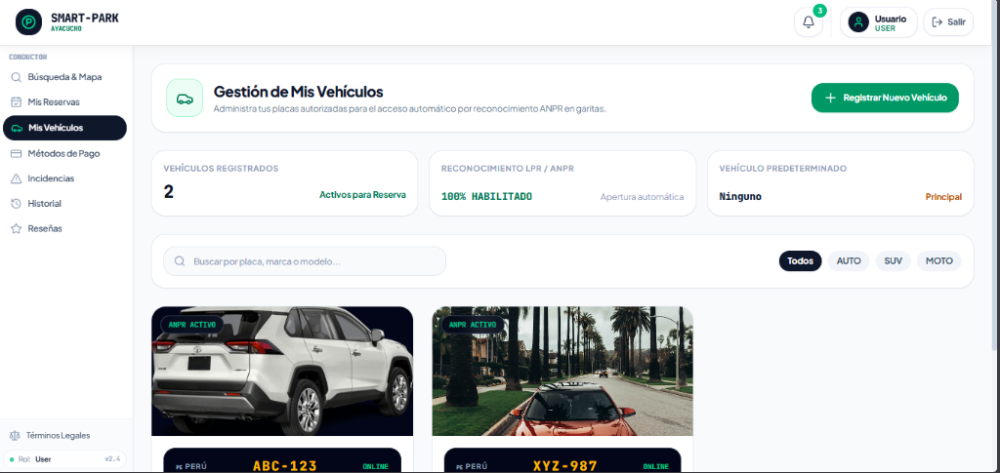

---

### 4.2. Visualizador de Plano 2D vs. Estudio CAD (`InteractiveFloorPlanDrawingStudio.jsx`)
* **Propósito:** Visualización e ingeniería topográfica digital de la distribución física de la cochera con modos estrictamente diferenciados.
* **Modos de Operación:**
  - **Modo Visualizador 2D ("Ver" - Solo Lectura):**
    - Diseñado para inspección rápida sin riesgo de alterar o mover elementos accidentalmente.
    - Oculta presets, auto-numeración, deshacer/rehacer, rejilla y herramientas de dibujo.
    - Al seleccionar cualquier plaza, despliega una tarjeta de especificaciones de solo lectura (código, tipo auto/moto, techado, estado libre/ocupado, matrícula y dimensiones).
    - Muestra métricas globales de la sede (total plazas, libres, ocupadas, motos y techadas).
  - **Modo Editor CAD ("Editar Plano" - Totalmente Interactivo):**
    - Herramienta completa de arquitectura y trazado: añadir cajones para autos, motos y techadas.
    - Trazado de muros perimetrales, carriles viales con flechas direccionales, pasos peatonales cebra, jardines y garitas con sensores ANPR.
    - Auto-renumeración espacial inteligente, snapping a rejilla imantada, rotación libre en 360°, duplicación y alineación en el lote.
    - Guardado y persistencia en tiempo real en la base de datos de la sede.

#### 📸 Captura del CAD Drawing Studio:
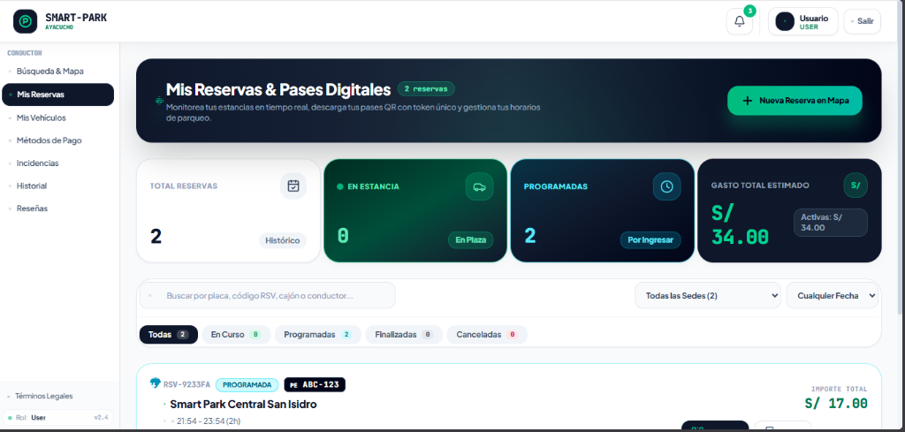

---

### 4.3. Control de Garita & Lector LPR Inteligente (`ANPRMonitor.jsx`)
* **Propósito:** Consola operativa para el guardia u operador de garita con hardware de cámara y control de acceso.
* **Funcionalidades:**
  - **Visor de Cámara CCTV / WebCam:** Transmisión de video con encuadre de captura de placa.
  - **Reconocimiento OCR Ultrarrápido (`plateOcr.js`):** Normalización y corrección de caracteres confusos (ej. `O` por `0`, `I` por `1`) con verificación de reservas en base de datos.
  - **Mando de Barrera Manual:** Botón directo integrado en el encabezado `[ Abrir Barrera ]` / `[ Barrera Abierta ]`.
  - **Emisión Rápida de Tickets Presenciales:** Emite ticket con plaza asignada en 1 clic para clientes sin reserva previa.
  - **Monitor de Vehículos en Cochera:** Lista en tiempo real de los autos estacionados con su tiempo de estancia y botón de `Salida`.
  - **Bitácora de Accesos:** Registro cronológico de ingresos, salidas, placas y montos recaudados con exportación a CSV.

#### 📸 Captura de la Consola de Garita LPR:
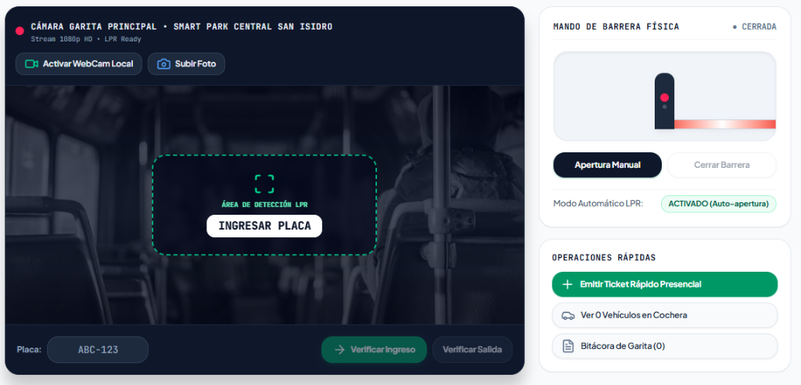

---

### 4.4. Directorio de Personal & Credenciales de Acceso (`StaffModule.jsx`)
* **Propósito:** Administración integral de la nómina de colaboradores, operadores de garita, guardias de seguridad y supervisores del establecimiento.
* **Capacidades Principales:**
  - **Asignación de Credenciales de Acceso:** Configuración directa de correo electrónico y contraseña segura (con visor de clave `Eye`/`EyeOff` y generador de claves de alta entropía) para que los trabajadores inicien sesión directamente con rol operativo local.
  - **Control de Turnos & PIN de Garita:** Gestión de turnos (*Mañana, Tarde, Noche, Rotativo 24/7*), cargos operativos y PIN numérico de 4 dígitos para validación rápida en garita/ANPR.
  - **Gestión Rápida de Claves & Estados:** Modales simplificados para restablecer contraseñas de trabajadores al instante y suspender o reactivar accesos con un clic (sin campos de rol confusos o redundantes).
  - **Exportación de Nómina:** Descarga de reportes en formato CSV con el estado de credenciales activas.

---

### 4.5. Reportes de Ocupación & Rendimiento (`AnalyticsGlobalModule.jsx`)
* **Propósito:** Gráficos analíticos de afluencia vehicular por horas pico, tasa de rotación de cajones e ingresos acumulados en Nuevos Soles.

---

### 4.6. Diagnóstico y Resiliencia de Servicios (`ResiliencySimModule.jsx`)
* **Propósito:** Monitoreo del estado de salud de la base de datos, servidores de OCR y tolerancia a cortes de red en garita.

---

## 5. Vistas del Rol Super Administrador de Plataforma (Platform)

### 5.1. Dashboard Global de la Red (`PlatformGlobalDashboard.jsx`)
* **Propósito:** Centro de comando consolidado para la supervisión de toda la red de estacionamientos afiliados en Ayacucho.
* **Métricas Principales:** Total de cocheras activas, plazas totales de la red, plazas ocupadas en tiempo real y facturación consolidada.

---

### 5.2. Finanzas & Liquidaciones por Sede (`PlatformFinancesModule.jsx`)
* **Propósito:** Control de transferencias bancarias, retención de comisiones de plataforma y pagos liquidados a cada propietario de cochera.

---

### 5.3. Afiliación & Auditoría de Sedes (`AffiliatedParkingsModule.jsx`)
* **Propósito:** Aprobación de nuevas playas de estacionamiento, supervisión de licencias municipales y estado de afiliación en Ayacucho.

---

### 5.4. Gestión de Usuarios & Permisos RBAC (`UserRolesModule.jsx`)
* **Propósito:** Administración de accesos, bloqueo preventivo y asignación de privilegios para administradores y cajeros.

---

### 5.5. Ajustes Globales de Plataforma (`PlatformSettingsModule.jsx`)
* **Propósito:** Configuración de parámetros globales del sistema, pasarelas de pago, tarifas base y políticas del servicio.

---

## 6. Diseño Responsivo & Reglas de Estilo

1. **Cero Badges Innecesarios:**
   - La interfaz utiliza etiquetas de texto sobrias y directas, evitando saturar con píldoras o insignias decorativas.
2. **Navegación Móvil Flotante Glassmorphism:**
   - En pantallas pequeñas (`< 768px`), el sistema activa la barra de navegación curva inferior con botón activo elevado y menú desplegable *Drawer* para un manejo ergonómico con una sola mano.
3. **Rejillas Elásticas (`grid-cols-1 sm:grid-cols-2 lg:grid-cols-4`):**
   - Garantizan que ningún texto o botón se corte en dispositivos móviles (iPhone, Android, Tablets y Laptops).
4. **Paleta de Colores Curada:**
   - Fondos claros y descansados (`slate-50`, `white`), contraste ejecutivo (`slate-900`, `slate-950`) y acentos de confirmación en verde esmeralda (`emerald-500`, `emerald-600`).

---

*Documentación generada y sincronizada con el repositorio master de Smart Park Ayacucho.*
